# Microservices with Node JS and React

## Table of Contents

- [Microservices with Node JS and React](#microservices-with-node-js-and-react)
  - [Table of Contents](#table-of-contents)
  - [**Section 01: Fundamental Ideas Around Microservices**](#section-01-fundamental-ideas-around-microservices)
    - [What Is a Microservice?](#what-is-a-microservice)
    - [Data in Microservices](#data-in-microservices)
    - [Big Problems with Data](#big-problems-with-data)
    - [Sync Communication Between Services](#sync-communication-between-services)
    - [Async: Event-Based Communication](#async-event-based-communication)
    - [Async: A Crazy Way of Storing Data](#async-a-crazy-way-of-storing-data)
    - [Pros and Cons of Async Communication](#pros-and-cons-of-async-communication)
  - [**Section 02: A Mini-Microservices App**](#section-02-a-mini-microservices-app)
    - [App Overview](#app-overview)
    - [Project Setup](#project-setup)
    - [Posts Service Creation](#posts-service-creation)
    - [Implementing a Comments Service](#implementing-a-comments-service)
    - [React Project Setup](#react-project-setup)
    - [Request Minimization Strategies](#request-minimization-strategies)
    - [An Async Solution](#an-async-solution)
    - [Common Questions Around Async Events](#common-questions-around-async-events)
    - [Event Bus Overview](#event-bus-overview)
    - [A Basic Event Bus Implementation](#a-basic-event-bus-implementation)
    - [Emitting Post Creation Events](#emitting-post-creation-events)
    - [Emitting Comment Creation Events](#emitting-comment-creation-events)
    - [Receiving Events](#receiving-events)
    - [Creating the Data Query Service](#creating-the-data-query-service)
    - [Parsing Incoming Events](#parsing-incoming-events)
    - [Using the Query Service](#using-the-query-service)
    - [Adding a Simple Feature](#adding-a-simple-feature)
    - [Issues with Comment Filtering](#issues-with-comment-filtering)
    - [A Second Approach](#a-second-approach)
    - [How to Handle Resource Updates](#how-to-handle-resource-updates)
    - [Creating the Moderation Service](#creating-the-moderation-service)
    - [Adding Comment Moderation](#adding-comment-moderation)
    - [Handling Moderation](#handling-moderation)
    - [Updating Comment Content](#updating-comment-content)
    - [Dealing with Missing Events](#dealing-with-missing-events)
    - [Implementing Event Sync](#implementing-event-sync)
    - [Event Syncing in Action](#event-syncing-in-action)
  - [**Running Services with Docker**](#running-services-with-docker)
  - [**Orchestrating Collections of Services with Kubernetes**](#orchestrating-collections-of-services-with-kubernetes)
  - [**Architecture of Multi-Service Apps**](#architecture-of-multi-service-apps)
  - [**Leveraging a Cloud Environment for Development**](#leveraging-a-cloud-environment-for-development)
  - [**Response Normalization Strategies**](#response-normalization-strategies)
  - [**Database Management and Modeling**](#database-management-and-modeling)
  - [**Authentication Strategies and Options**](#authentication-strategies-and-options)
  - [**Testing Isolated Microservices**](#testing-isolated-microservices)
  - [**Integrating a Server-Side-Rendered React App**](#integrating-a-server-side-rendered-react-app)
  - [**Code Sharing and Reuse Between Services**](#code-sharing-and-reuse-between-services)
  - [**Create-Read-Update-Destroy Server Setup**](#create-read-update-destroy-server-setup)
  - [**NATS Streaming Server - An Event Bus Implementation**](#nats-streaming-server---an-event-bus-implementation)
  - [**Connecting to NATS in a Node JS World**](#connecting-to-nats-in-a-node-js-world)
  - [**Managing a NATS Client**](#managing-a-nats-client)
  - [**Cross-Service Data Replication In Action**](#cross-service-data-replication-in-action)
  - [**Understanding Event Flow**](#understanding-event-flow)
  - [**Listening for Events and Handling Concurrency Issues**](#listening-for-events-and-handling-concurrency-issues)
  - [**Worker Services**](#worker-services)
  - [**Handling Payments**](#handling-payments)
  - [**Back to the Client**](#back-to-the-client)
  - [**CI/CD**](#cicd)

## **Section 01: Fundamental Ideas Around Microservices**

### What Is a Microservice?

A monolith contains

- Routing
- Middleware
- Business Logic
- Database access
to implement all features of our app

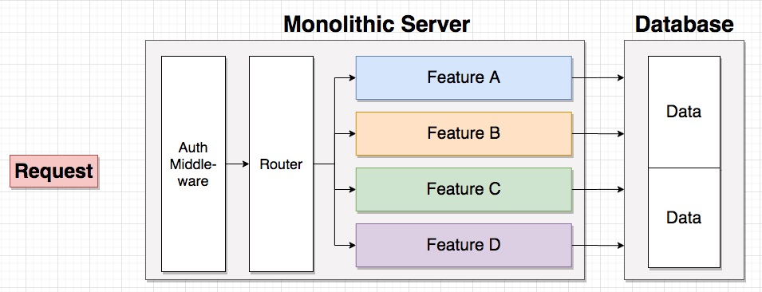

A single microservice contains

- Routing
- Middleware
- Business Logic
- Database access
to implement one feature of our app


**[⬆ back to top](#table-of-contents)**

### Data in Microservices

Data management between services

- This is the big problem of microservices, and what 90% of this course focuses on

With microservices, we store and access data in sort of strange way. Let's look at 

- how we store data: Each service gets its own database (if it needs one) 
- how we access it: Services will never, ever reach into another services database


Why Database-Per-Service pattern?

- We want each service to run independently of other services


- Database schema/structure might change unexpectedly

- Some services might function more efficiently with different types of DB's (sql vs nosql)

**[⬆ back to top](#table-of-contents)**

### Big Problems with Data

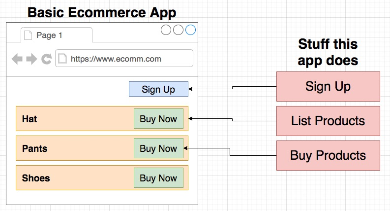


**[⬆ back to top](#table-of-contents)**

### Sync Communication Between Services

Communication Strategies Between Services
- Sync: Services communicate with each other using direct requests
- Async: Services communicate with each other using events

Notes on Sync Communication

| Pro                              | Con                                                           |
| -------------------------------- | ------------------------------------------------------------- |
| Conceptually easy to understand! | Introduces a dependency between services                      |
| Service D won't need a database! | If any inter-service request fails, the overall request fails |
|                                  | The entire request is only as fast as the slowest request     |
|                                  | Can easily introduce webs of requests                         |


**[⬆ back to top](#table-of-contents)**

### Async: Event-Based Communication

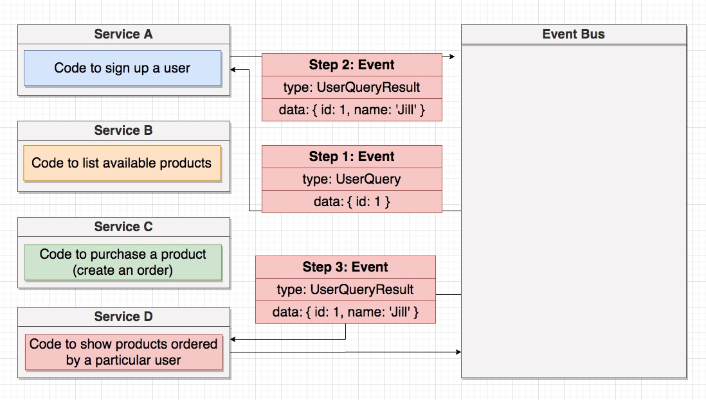

**[⬆ back to top](#table-of-contents)**

### Async: A Crazy Way of Storing Data

Service D: Code to show products ordered by a particular user
Let's refine the exact goal of this service
Service D: Given the ID of a user, show the title and image for every product they have ever ordered

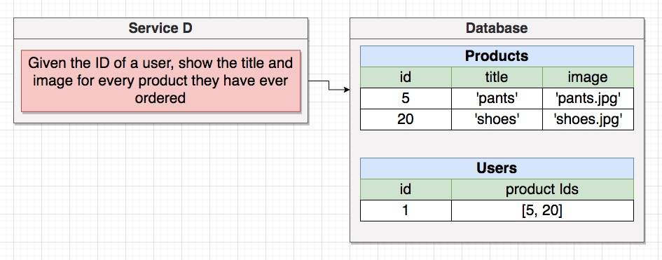

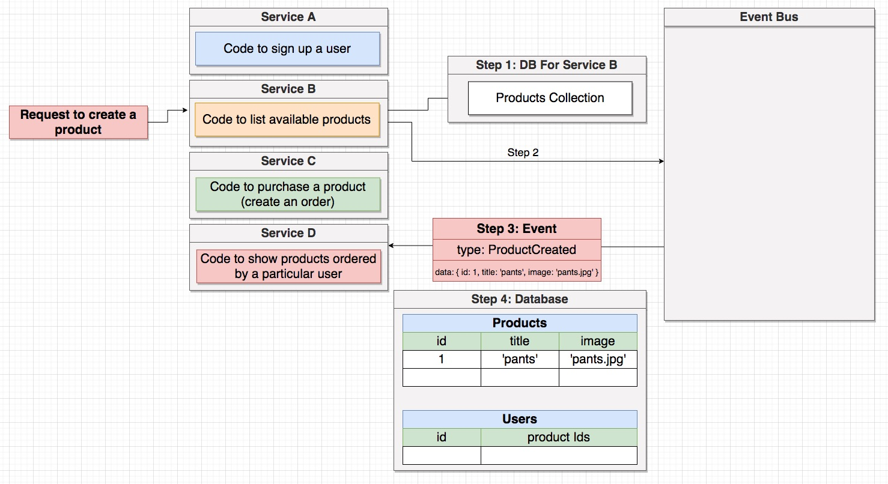


**[⬆ back to top](#table-of-contents)**

### Pros and Cons of Async Communication

| Pros                                               | Cons                 |
| -------------------------------------------------- | -------------------- |
| Service D has zero dependencies on other services! | Data duplication.    |
| Service D will be extremely fast!                  | Harder to understand |

**[⬆ back to top](#table-of-contents)**

## **Section 02: A Mini-Microservices App**

### App Overview

Goals

- Get a taste of a microservices architecture
- Build as much as possible from scratch


What services should we create?

- For now, we will create one separate service for each resource in our app


**[⬆ back to top](#table-of-contents)**

### Project Setup


Initial App Setup

- Generate a new React App using Create-React-App
- Create an Express-based project for the Posts Service
- Create an Express-based project for the Comments Service

**[⬆ back to top](#table-of-contents)**

### Posts Service Creation


**[⬆ back to top](#table-of-contents)**

### Implementing a Comments Service

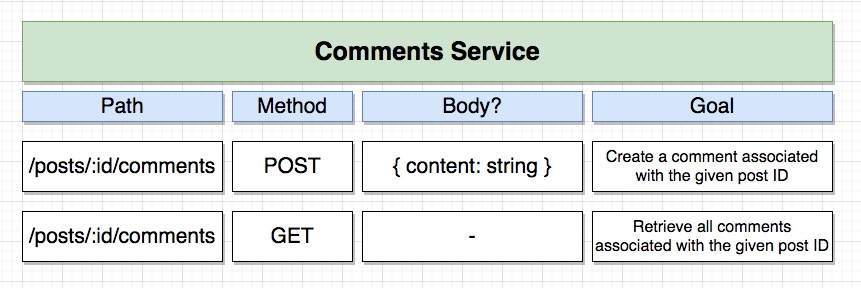
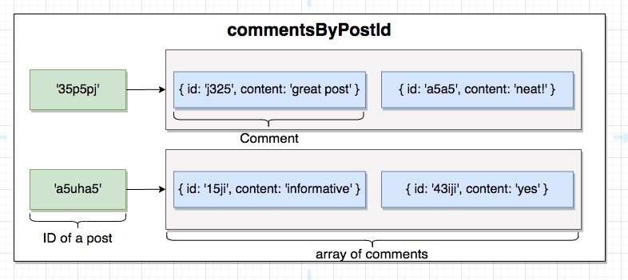

**[⬆ back to top](#table-of-contents)**

### React Project Setup

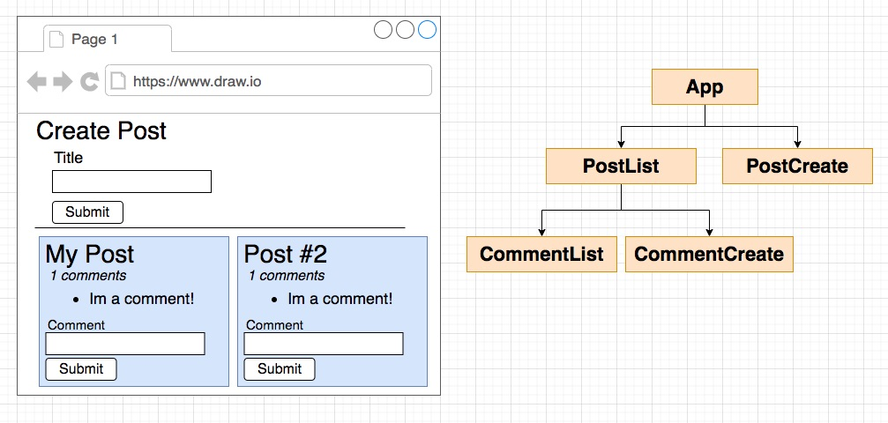

**[⬆ back to top](#table-of-contents)**

### Request Minimization Strategies

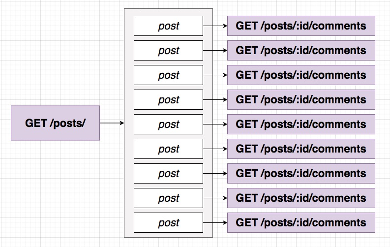
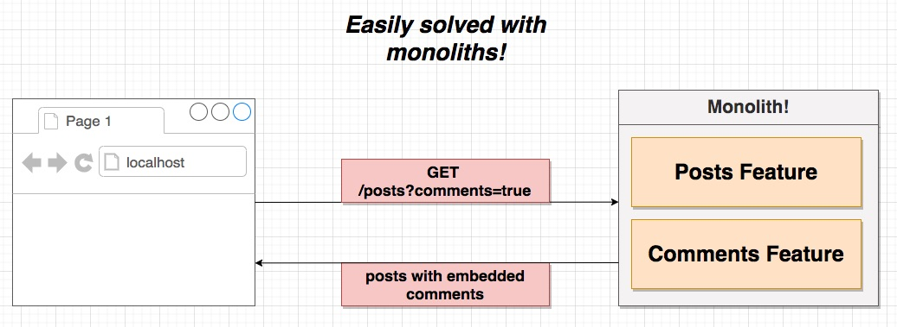
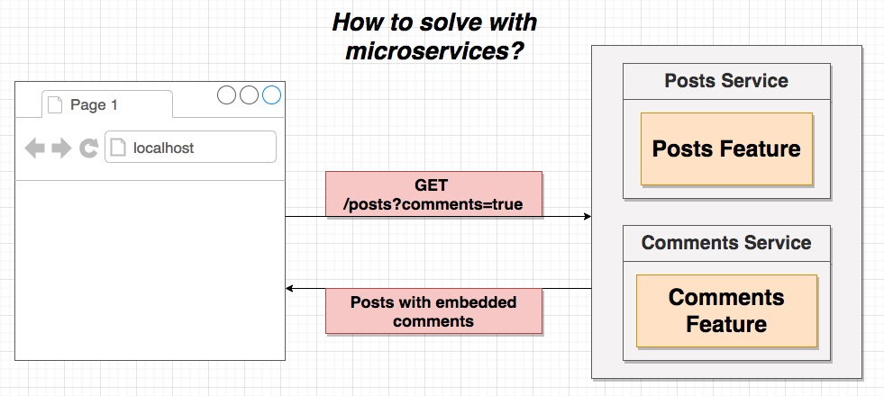


Notes on Sync Communication

| Pro                              | Con                                                           |
| -------------------------------- | ------------------------------------------------------------- |
| Conceptually easy to understand! | Introduces a dependency between services                      |
|                                  | If any inter-service request fails, the overall request fails |
|                                  | The entire request is only as fast as the slowest request     |
|                                  | Can easily introduce webs of requests                         |

**[⬆ back to top](#table-of-contents)**

### An Async Solution

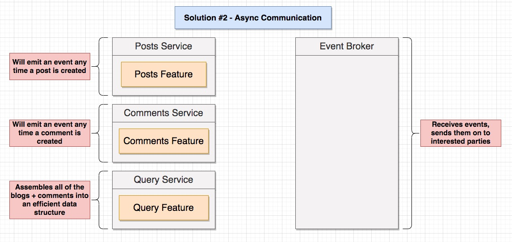
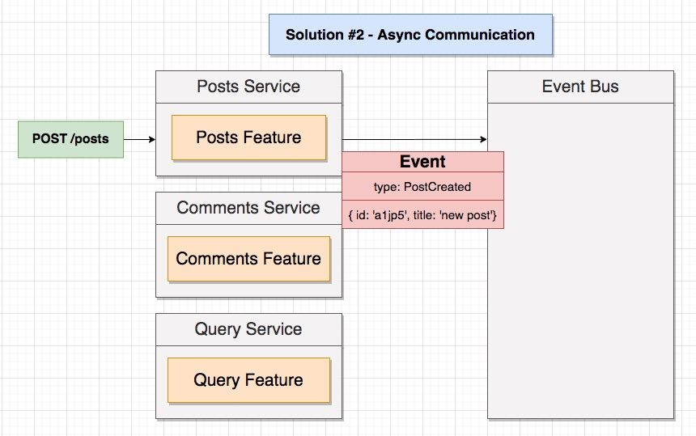

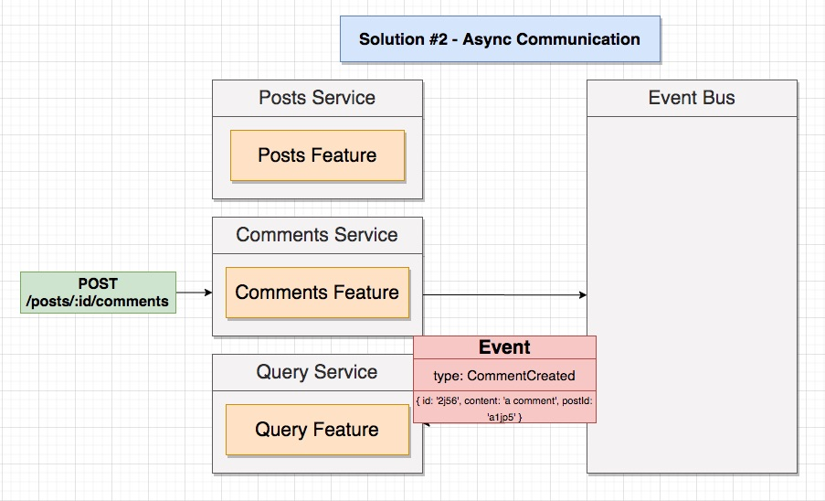


Notes on Async Communication

| Pros                                                   | Cons                 |
| ------------------------------------------------------ | -------------------- |
| Query Service has zero dependencies on other services! | Data duplication.    |
| Query Service will be extremely fast!                  | Harder to understand |

**[⬆ back to top](#table-of-contents)**

### Common Questions Around Async Events


Wait, so you're saying we need to create a new service every time we need to join some data?!?!?!?!?!?
> Absolutely not!  In reality, might not even have posts and comments in separate services in the first place

Who cares that each service is independent?
> Independent services + the reliability that brings is one of the core reasons of using microservices in the first place

This is so over the top complicated for little benefit
> Seems that way now!  Adding in some features starts to get really easy when we use this architecture

This system won't correctly in the following scenario....
> There are some very special things we need to consider with this design.  I've got solutions for most (maybe?) of the concerns you may have

**[⬆ back to top](#table-of-contents)**

### Event Bus Overview

Event Bus

- Many different implementations. RabbitMQ, Kafka, NATS...
- Receives events, publishes them to listeners
- Many different subtle features that make async communication way easier or way harder
- We are going to build our own event bus using Express. It will not implement the vast majority of features a normal bus has.
- Yes, for our next app we will use a production grade, open source event bus

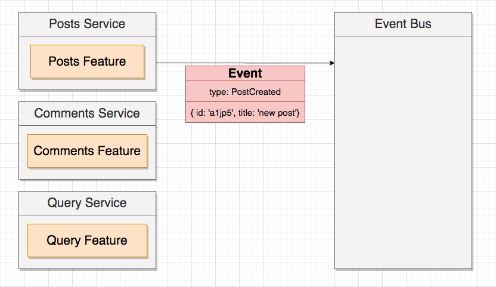

**[⬆ back to top](#table-of-contents)**

### A Basic Event Bus Implementation


```javascript
// event-bus/index.js
const express = require('express');
const bodyParser = require('body-parser');
const axios = require('axios');

const app = express();
app.use(bodyParser.json());

app.post('/events', (req, res) => {
  const event = req.body;

  axios.post('http://localhost:4000/events', event);
  axios.post('http://localhost:4001/events', event);
  axios.post('http://localhost:4002/events', event);

  res.send({ status: 'OK' });
});

app.listen(4005, () => {
  console.log('Listening on 4005');
});
```

**[⬆ back to top](#table-of-contents)**

### Emitting Post Creation Events


```javascript
// posts/index.js
const posts = {};
app.post('/posts', async (req, res) => {
  const id = randomBytes(4).toString('hex');
  const { title } = req.body;

  posts[id] = {
    id,
    title
  };

  await axios.post('http://localhost:4005/events', {
    type: 'PostCreated',
    data: {
      id,
      title
    }
  });

  res.status(201).send(posts[id]);
});
```

**[⬆ back to top](#table-of-contents)**

### Emitting Comment Creation Events


```javascript
// comments/index.js
const commentsByPostId = {};
app.post('/posts/:id/comments', async (req, res) => {
  const commentId = randomBytes(4).toString('hex');
  const { content } = req.body;

  const comments = commentsByPostId[req.params.id] || [];
  comments.push({ id: commentId, content });
  commentsByPostId[req.params.id] = comments;

  await axios.post('http://localhost:4005/events', {
    type: 'CommentCreated',
    data: {
      id: commentId,
      content,
      postId: req.params.id
    }
  });

  res.status(201).send(comments);
});
```

**[⬆ back to top](#table-of-contents)**

### Receiving Events

```javascript
// posts/index.js
// comments/index.js
app.post('/events', (req, res) => {
  console.log('Received Event', req.body.type);

  res.send({});
});
```

**[⬆ back to top](#table-of-contents)**

### Creating the Data Query Service


```javascript
// query/index.js
app.get('/posts', (req, res) => {});
app.post('/events', (req, res) => {});
```

**[⬆ back to top](#table-of-contents)**

### Parsing Incoming Events

```javascript
// query/index.js
app.get('/posts', (req, res) => {
  res.send(posts);
});

app.post('/events', (req, res) => {
  const { type, data } = req.body;

  if (type === 'PostCreated') {
    const { id, title } = data;

    posts[id] = { id, title, comments: [] };
  }

  if (type === 'CommentCreated') {
    const { id, content, postId } = data;

    const post = posts[postId];
    post.comments.push({ id, content });
  }

  console.log(posts);

  res.send({});
});
```

**[⬆ back to top](#table-of-contents)**

### Using the Query Service


**[⬆ back to top](#table-of-contents)**

### Adding a Simple Feature

Feature Request

- Add in comment moderation.
- Flag comments that contain the word 'orange'.

Feature Clarifications

- Super easy to implement in the React app, but not if the filter list changes frequently
- Super easy to implement in the existing comments service, but let's assume we want to add a new service
- It might take a long time for the new service to moderate a comment.

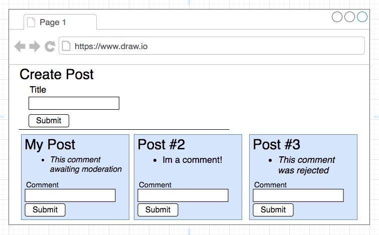
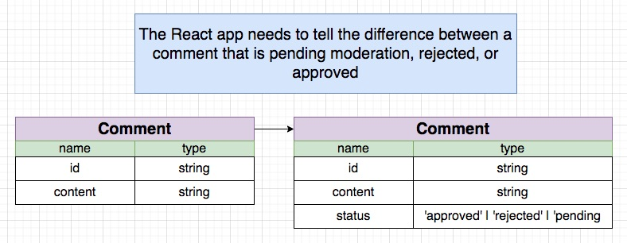

**[⬆ back to top](#table-of-contents)**

### Issues with Comment Filtering


**[⬆ back to top](#table-of-contents)**

### A Second Approach


- The query service is about presentation logic
- It is joining two resources right now (posts and comments), but it might join 10!
- Does it make sense for a presentation service to understand how to process a very precise update?


**[⬆ back to top](#table-of-contents)**

### How to Handle Resource Updates

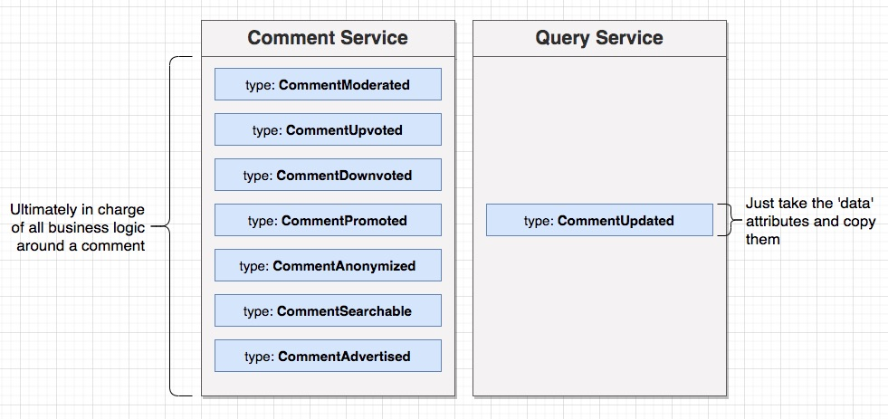


**[⬆ back to top](#table-of-contents)**

### Creating the Moderation Service

```javascript
// moderation/index.js
const express = require('express');
const bodyParser = require('body-parser');
const axios = require('axios');

const app = express();
app.use(bodyParser.json());

app.post('/events', (req, res) => {});

app.listen(4003, () => {
  console.log('Listening on 4003');
});
```

**[⬆ back to top](#table-of-contents)**

### Adding Comment Moderation


**[⬆ back to top](#table-of-contents)**

### Handling Moderation

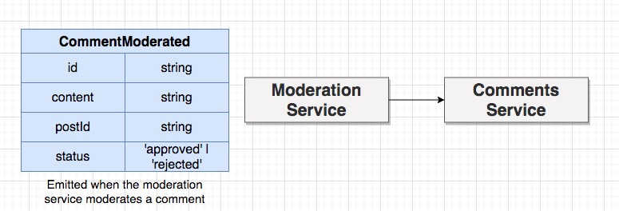

**[⬆ back to top](#table-of-contents)**

### Updating Comment Content

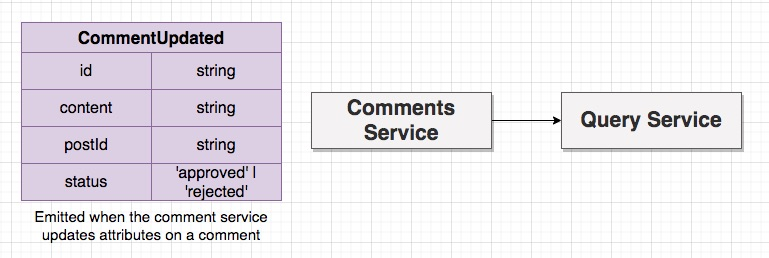

**[⬆ back to top](#table-of-contents)**

### Dealing with Missing Events

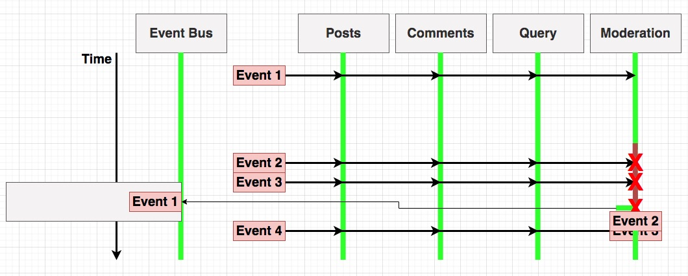
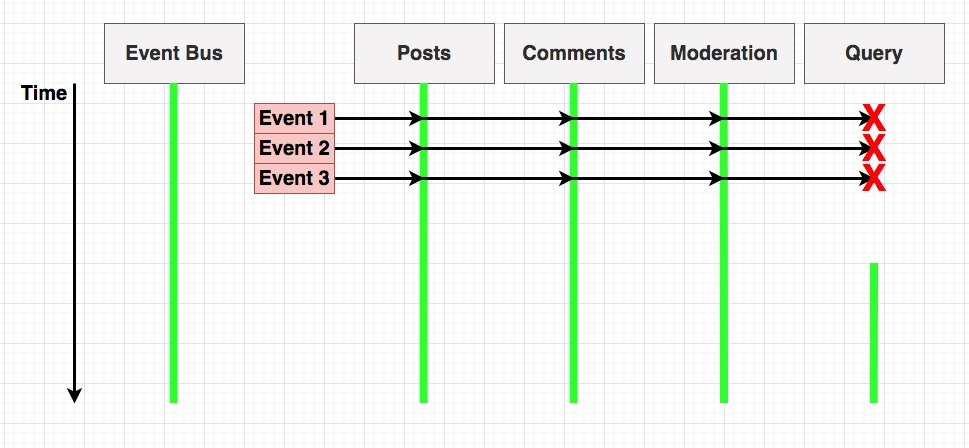
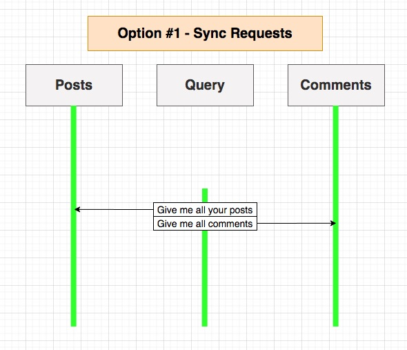


**[⬆ back to top](#table-of-contents)**

### Implementing Event Sync
**[⬆ back to top](#table-of-contents)**

### Event Syncing in Action
**[⬆ back to top](#table-of-contents)**

## **Running Services with Docker**

**[⬆ back to top](#table-of-contents)**

## **Orchestrating Collections of Services with Kubernetes**

**[⬆ back to top](#table-of-contents)**

## **Architecture of Multi-Service Apps**

**[⬆ back to top](#table-of-contents)**

## **Leveraging a Cloud Environment for Development**

**[⬆ back to top](#table-of-contents)**

## **Response Normalization Strategies**

**[⬆ back to top](#table-of-contents)**

## **Database Management and Modeling**

**[⬆ back to top](#table-of-contents)**

## **Authentication Strategies and Options**

**[⬆ back to top](#table-of-contents)**

## **Testing Isolated Microservices**

**[⬆ back to top](#table-of-contents)**

## **Integrating a Server-Side-Rendered React App**

**[⬆ back to top](#table-of-contents)**

## **Code Sharing and Reuse Between Services**

**[⬆ back to top](#table-of-contents)**

## **Create-Read-Update-Destroy Server Setup**

**[⬆ back to top](#table-of-contents)**

## **NATS Streaming Server - An Event Bus Implementation**

**[⬆ back to top](#table-of-contents)**

## **Connecting to NATS in a Node JS World**

**[⬆ back to top](#table-of-contents)**

## **Managing a NATS Client**

**[⬆ back to top](#table-of-contents)**

## **Cross-Service Data Replication In Action**

**[⬆ back to top](#table-of-contents)**

## **Understanding Event Flow**

**[⬆ back to top](#table-of-contents)**

## **Listening for Events and Handling Concurrency Issues**

**[⬆ back to top](#table-of-contents)**

## **Worker Services**

**[⬆ back to top](#table-of-contents)**

## **Handling Payments**

**[⬆ back to top](#table-of-contents)**

## **Back to the Client**

**[⬆ back to top](#table-of-contents)**

## **CI/CD**

**[⬆ back to top](#table-of-contents)**
