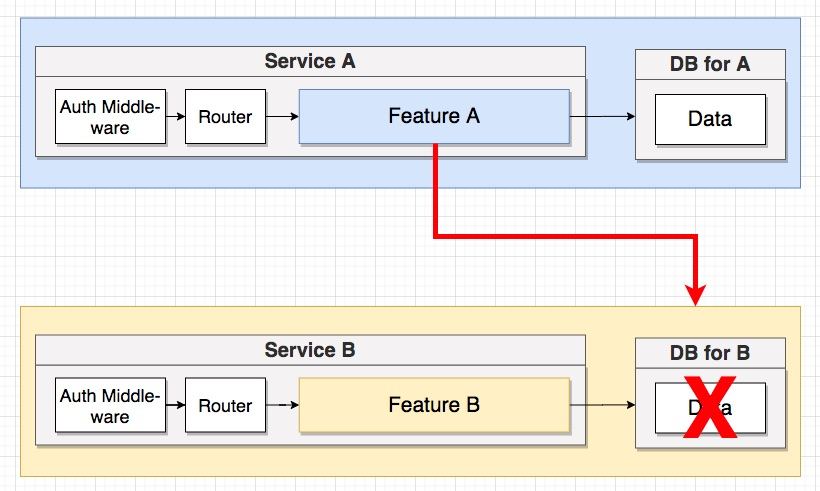
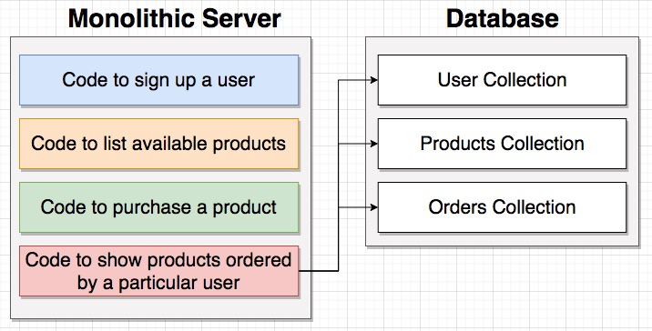
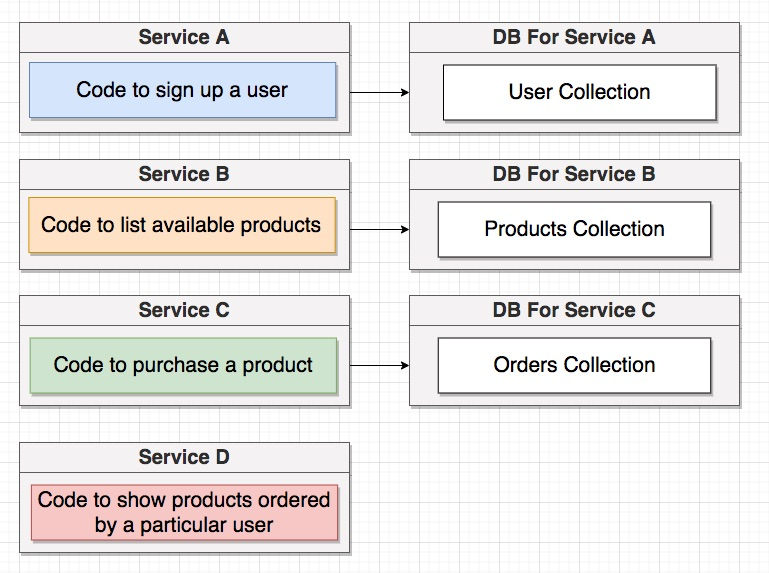
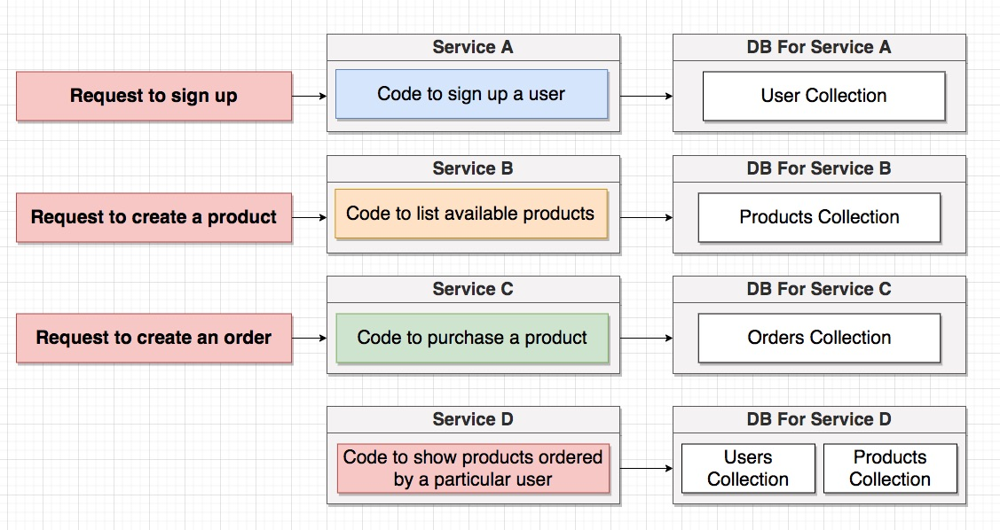
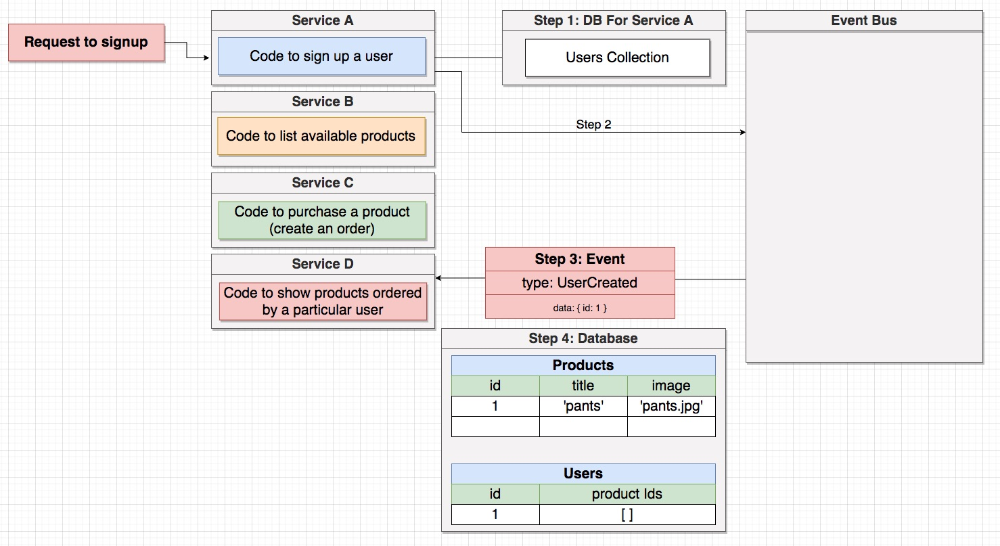
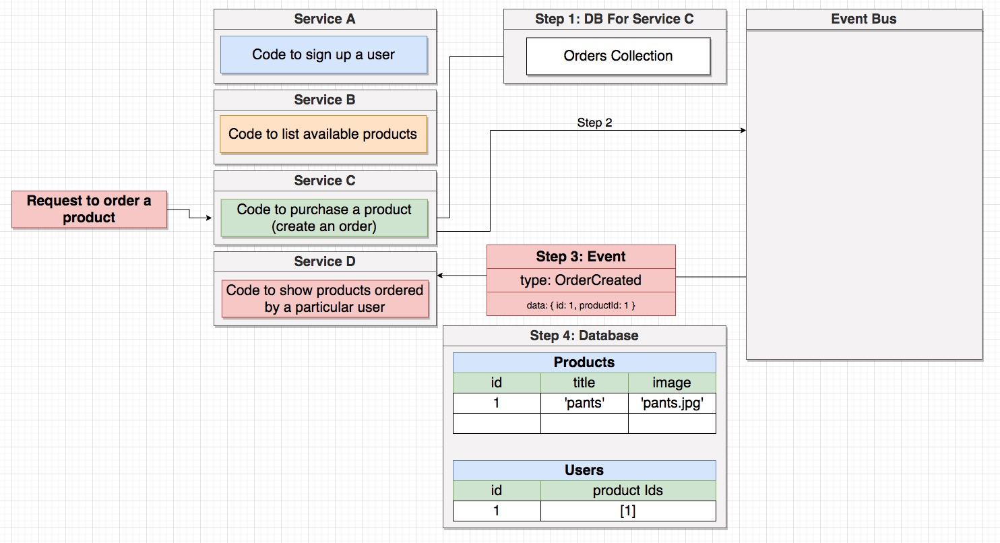
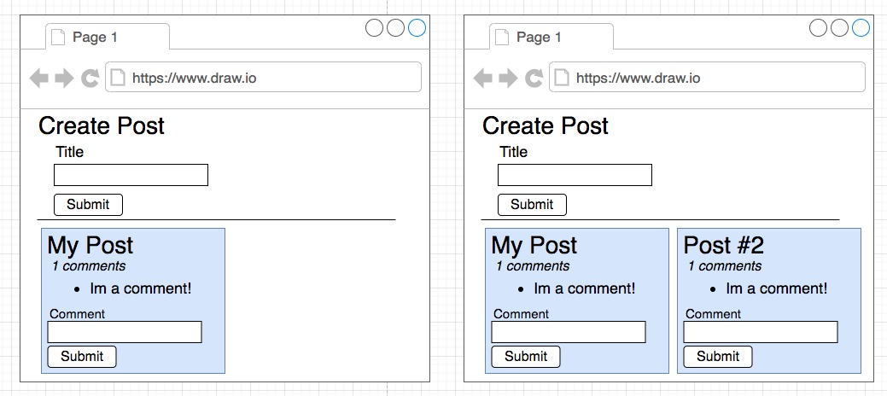
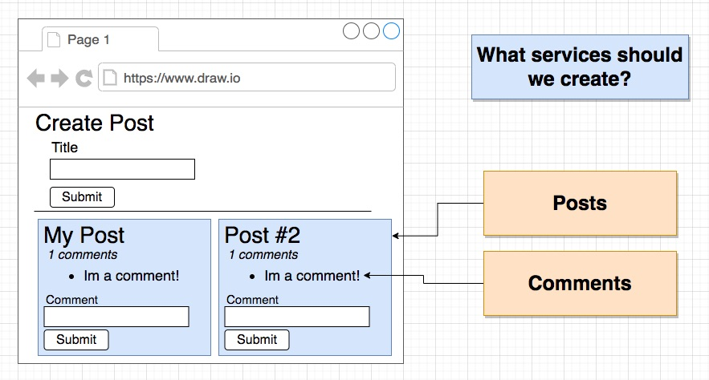
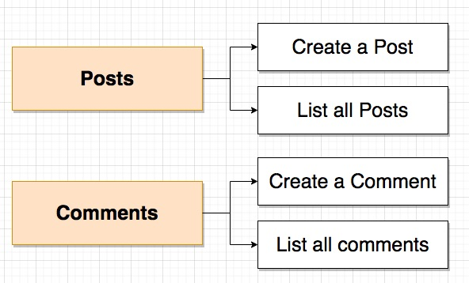
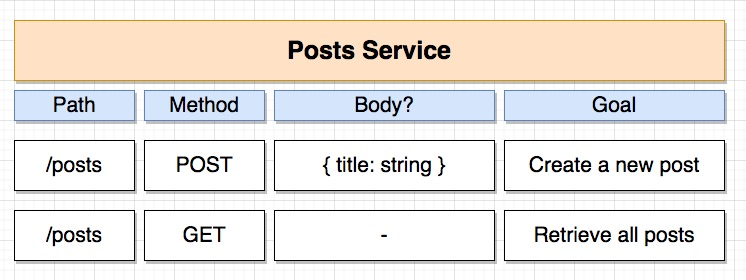

# Microservices with Node JS and React

## Table of Contents

- [Microservices with Node JS and React](#microservices-with-node-js-and-react)
  - [Table of Contents](#table-of-contents)
  - [**Section 01: Fundamental Ideas Around Microservices**](#section-01-fundamental-ideas-around-microservices)
    - [What Is a Microservice?](#what-is-a-microservice)
    - [Data in Microservices](#data-in-microservices)
    - [Big Problems with Data](#big-problems-with-data)
    - [Sync Communication Between Services](#sync-communication-between-services)
    - [Async: Event-Based Communication](#async-event-based-communication)
    - [Async: A Crazy Way of Storing Data](#async-a-crazy-way-of-storing-data)
    - [Pros and Cons of Async Communication](#pros-and-cons-of-async-communication)
  - [**Section 02: A Mini-Microservices App**](#section-02-a-mini-microservices-app)
    - [App Overview](#app-overview)
    - [Project Setup](#project-setup)
    - [Posts Service Creation](#posts-service-creation)
    - [Testing the Posts Service](#testing-the-posts-service)
    - [Implementing a Comments Service](#implementing-a-comments-service)
    - [Quick Comments Test](#quick-comments-test)
    - [Note on the React App](#note-on-the-react-app)
    - [React Project Setup](#react-project-setup)
    - [Building Post Submission](#building-post-submission)
    - [Handling CORS Errors](#handling-cors-errors)
    - [Fetching and Rendering Posts](#fetching-and-rendering-posts)
    - [Creating Comments](#creating-comments)
    - [Displaying Comments](#displaying-comments)
    - [Completed React App](#completed-react-app)
    - [Request Minimization Strategies](#request-minimization-strategies)
    - [An Async Solution](#an-async-solution)
    - [Common Questions Around Async Events](#common-questions-around-async-events)
    - [Event Bus Overview](#event-bus-overview)
    - [A Basic Event Bus Implementation](#a-basic-event-bus-implementation)
    - [Emitting Events](#emitting-events)
    - [Emitting Comment Creation Events](#emitting-comment-creation-events)
    - [Receiving Events](#receiving-events)
    - [Creating the Data Query Service](#creating-the-data-query-service)
    - [Parsing Incoming Events](#parsing-incoming-events)
    - [Using the Query Service](#using-the-query-service)
    - [Adding a Simple Feature](#adding-a-simple-feature)
    - [Issues with Comment Filtering](#issues-with-comment-filtering)
    - [A Second Approach](#a-second-approach)
    - [How to Handle Resource Updates](#how-to-handle-resource-updates)
    - [Creating the Moderation Service](#creating-the-moderation-service)
    - [Adding Comment Moderation](#adding-comment-moderation)
    - [Handling Moderation](#handling-moderation)
    - [Updating Comment Content](#updating-comment-content)
    - [A Quick Test](#a-quick-test)
    - [Rendering Comments by Status](#rendering-comments-by-status)
    - [Dealing with Missing Events](#dealing-with-missing-events)
    - [Implementing Event Sync](#implementing-event-sync)
    - [Event Syncing in Action](#event-syncing-in-action)
  - [**Running Services with Docker**](#running-services-with-docker)
  - [**Orchestrating Collections of Services with Kubernetes**](#orchestrating-collections-of-services-with-kubernetes)
  - [**Architecture of Multi-Service Apps**](#architecture-of-multi-service-apps)
  - [**Leveraging a Cloud Environment for Development**](#leveraging-a-cloud-environment-for-development)
  - [**Response Normalization Strategies**](#response-normalization-strategies)
  - [**Database Management and Modeling**](#database-management-and-modeling)
  - [**Authentication Strategies and Options**](#authentication-strategies-and-options)
  - [**Testing Isolated Microservices**](#testing-isolated-microservices)
  - [**Integrating a Server-Side-Rendered React App**](#integrating-a-server-side-rendered-react-app)
  - [**Code Sharing and Reuse Between Services**](#code-sharing-and-reuse-between-services)
  - [**Create-Read-Update-Destroy Server Setup**](#create-read-update-destroy-server-setup)
  - [**NATS Streaming Server - An Event Bus Implementation**](#nats-streaming-server---an-event-bus-implementation)
  - [**Connecting to NATS in a Node JS World**](#connecting-to-nats-in-a-node-js-world)
  - [**Managing a NATS Client**](#managing-a-nats-client)
  - [**Cross-Service Data Replication In Action**](#cross-service-data-replication-in-action)
  - [**Understanding Event Flow**](#understanding-event-flow)
  - [**Listening for Events and Handling Concurrency Issues**](#listening-for-events-and-handling-concurrency-issues)
  - [**Worker Services**](#worker-services)
  - [**Handling Payments**](#handling-payments)
  - [**Back to the Client**](#back-to-the-client)
  - [**CI/CD**](#cicd)

## **Section 01: Fundamental Ideas Around Microservices**

### What Is a Microservice?

A monolith contains

- Routing
- Middleware
- Business Logic
- Database access
to implement all features of our app

A single microservice contains

- Routing
- Middleware
- Business Logic
- Database access
to implement one feature of our app

**[⬆ back to top](#table-of-contents)**

### Data in Microservices

Data management between services

- This is the big problem of microservices, and what 90% of this course focuses on

With microservices, we store and access data in sort of strange way. Let's look at 

- how we store data: Each service gets its own database (if it needs one) 
- how we access it: Services will never, ever reach into another services database

Why Database-Per-Service pattern?

- We want each service to run independently of other services

- Database schema/structure might change unexpectedly

- Some services might function more efficiently with different types of DB's (sql vs nosql)

**[⬆ back to top](#table-of-contents)**

### Big Problems with Data

**[⬆ back to top](#table-of-contents)**

### Sync Communication Between Services

Communication Strategies Between Services
- Sync: Services communicate with each other using direct requests
- Async: Services communicate with each other using events

Notes on Sync Communication
| Pro                              | Con                                                           |
| -------------------------------- | ------------------------------------------------------------- |
| Conceptually easy to understand! | Introduces a dependency between services                      |
| Service D won't need a database! | If any inter-service request fails, the overall request fails |
|                                  | The entire request is only as fast as the slowest request     |
|                                  | Can easily introduce webs of requests                         |

**[⬆ back to top](#table-of-contents)**

### Async: Event-Based Communication

**[⬆ back to top](#table-of-contents)**

### Async: A Crazy Way of Storing Data

Service D: Code to show products ordered by a particular user
Let's refine the exact goal of this service
Service D: Given the ID of a user, show the title and image for every product they have ever ordered

**[⬆ back to top](#table-of-contents)**

### Pros and Cons of Async Communication

| Pros                                               | Cons                 |
| -------------------------------------------------- | -------------------- |
| Service D has zero dependencies on other services! | Data duplication.    |
| Service D will be extremely fast!                  | Harder to understand |

**[⬆ back to top](#table-of-contents)**

## **Section 02: A Mini-Microservices App**

### App Overview

Goals

- Get a taste of a microservices architecture
- Build as much as possible from scratch

What services should we create?

- For now, we will create one separate service for each resource in our app

**[⬆ back to top](#table-of-contents)**

### Project Setup

Initial App Setup

- Generate a new React App using Create-React-App
- Create an Express-based project for the Posts Service
- Create an Express-based project for the Comments Service

**[⬆ back to top](#table-of-contents)**

### Posts Service Creation

**[⬆ back to top](#table-of-contents)**

### Testing the Posts Service
**[⬆ back to top](#table-of-contents)**

### Implementing a Comments Service
**[⬆ back to top](#table-of-contents)**

### Quick Comments Test
**[⬆ back to top](#table-of-contents)**

### Note on the React App
**[⬆ back to top](#table-of-contents)**

### React Project Setup
**[⬆ back to top](#table-of-contents)**

### Building Post Submission
**[⬆ back to top](#table-of-contents)**

### Handling CORS Errors
**[⬆ back to top](#table-of-contents)**

### Fetching and Rendering Posts
**[⬆ back to top](#table-of-contents)**

### Creating Comments
**[⬆ back to top](#table-of-contents)**

### Displaying Comments
**[⬆ back to top](#table-of-contents)**

### Completed React App
**[⬆ back to top](#table-of-contents)**

### Request Minimization Strategies
**[⬆ back to top](#table-of-contents)**

### An Async Solution
**[⬆ back to top](#table-of-contents)**

### Common Questions Around Async Events
**[⬆ back to top](#table-of-contents)**

### Event Bus Overview
**[⬆ back to top](#table-of-contents)**

### A Basic Event Bus Implementation
**[⬆ back to top](#table-of-contents)**

### Emitting Events
**[⬆ back to top](#table-of-contents)**

### Emitting Comment Creation Events
**[⬆ back to top](#table-of-contents)**

### Receiving Events
**[⬆ back to top](#table-of-contents)**

### Creating the Data Query Service
**[⬆ back to top](#table-of-contents)**

### Parsing Incoming Events
**[⬆ back to top](#table-of-contents)**

### Using the Query Service
**[⬆ back to top](#table-of-contents)**

### Adding a Simple Feature
**[⬆ back to top](#table-of-contents)**

### Issues with Comment Filtering
**[⬆ back to top](#table-of-contents)**

### A Second Approach
**[⬆ back to top](#table-of-contents)**

### How to Handle Resource Updates
**[⬆ back to top](#table-of-contents)**

### Creating the Moderation Service
**[⬆ back to top](#table-of-contents)**

### Adding Comment Moderation
**[⬆ back to top](#table-of-contents)**

### Handling Moderation
**[⬆ back to top](#table-of-contents)**

### Updating Comment Content
**[⬆ back to top](#table-of-contents)**

### A Quick Test
**[⬆ back to top](#table-of-contents)**

### Rendering Comments by Status
**[⬆ back to top](#table-of-contents)**

### Dealing with Missing Events
**[⬆ back to top](#table-of-contents)**

### Implementing Event Sync
**[⬆ back to top](#table-of-contents)**

### Event Syncing in Action
**[⬆ back to top](#table-of-contents)**

## **Running Services with Docker**

**[⬆ back to top](#table-of-contents)**

## **Orchestrating Collections of Services with Kubernetes**

**[⬆ back to top](#table-of-contents)**

## **Architecture of Multi-Service Apps**

**[⬆ back to top](#table-of-contents)**

## **Leveraging a Cloud Environment for Development**

**[⬆ back to top](#table-of-contents)**

## **Response Normalization Strategies**

**[⬆ back to top](#table-of-contents)**

## **Database Management and Modeling**

**[⬆ back to top](#table-of-contents)**

## **Authentication Strategies and Options**

**[⬆ back to top](#table-of-contents)**

## **Testing Isolated Microservices**

**[⬆ back to top](#table-of-contents)**

## **Integrating a Server-Side-Rendered React App**

**[⬆ back to top](#table-of-contents)**

## **Code Sharing and Reuse Between Services**

**[⬆ back to top](#table-of-contents)**

## **Create-Read-Update-Destroy Server Setup**

**[⬆ back to top](#table-of-contents)**

## **NATS Streaming Server - An Event Bus Implementation**

**[⬆ back to top](#table-of-contents)**

## **Connecting to NATS in a Node JS World**

**[⬆ back to top](#table-of-contents)**

## **Managing a NATS Client**

**[⬆ back to top](#table-of-contents)**

## **Cross-Service Data Replication In Action**

**[⬆ back to top](#table-of-contents)**

## **Understanding Event Flow**

**[⬆ back to top](#table-of-contents)**

## **Listening for Events and Handling Concurrency Issues**

**[⬆ back to top](#table-of-contents)**

## **Worker Services**

**[⬆ back to top](#table-of-contents)**

## **Handling Payments**

**[⬆ back to top](#table-of-contents)**

## **Back to the Client**

**[⬆ back to top](#table-of-contents)**

## **CI/CD**

**[⬆ back to top](#table-of-contents)**
