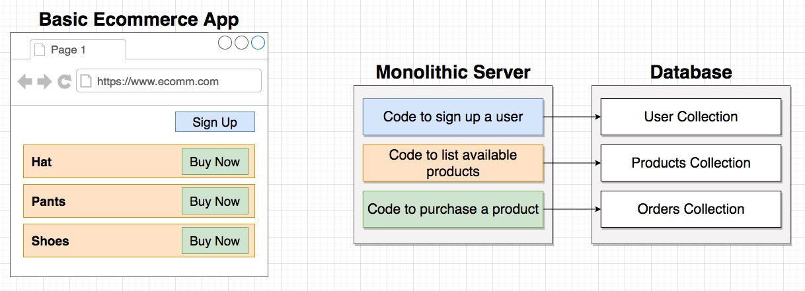
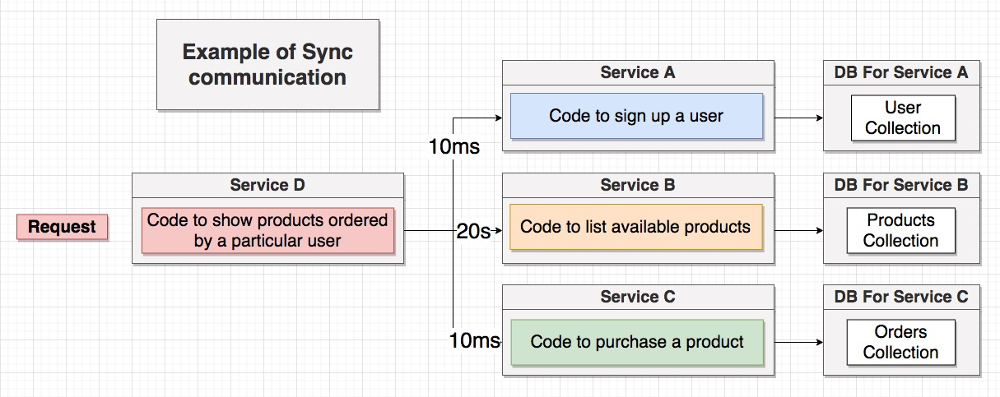

## **Section 01: Fundamental Ideas Around Microservices**

## Table of Contents
- [**Section 01: Fundamental Ideas Around Microservices**](#section-01-fundamental-ideas-around-microservices)
- [Table of Contents](#table-of-contents)
  - [What Is a Microservice?](#what-is-a-microservice)
  - [Data in Microservices](#data-in-microservices)
  - [Big Problems with Data](#big-problems-with-data)
  - [Sync Communication Between Services](#sync-communication-between-services)
  - [Async: Event-Based Communication](#async-event-based-communication)
  - [Async: A Crazy Way of Storing Data](#async-a-crazy-way-of-storing-data)
  - [Pros and Cons of Async Communication](#pros-and-cons-of-async-communication)
### What Is a Microservice?

A monolith contains

- Routing
- Middleware
- Business Logic
- Database access
to implement all features of our app

A single microservice contains

- Routing
- Middleware
- Business Logic
- Database access
to implement one feature of our app

**[⬆ back to top](#table-of-contents)**

### Data in Microservices

Data management between services

- This is the big problem of microservices, and what 90% of this course focuses on

With microservices, we store and access data in sort of strange way. Let's look at 

- how we store data: Each service gets its own database (if it needs one) 
- how we access it: Services will never, ever reach into another services database

Why Database-Per-Service pattern?

- We want each service to run independently of other services

- Database schema/structure might change unexpectedly

- Some services might function more efficiently with different types of DB's (sql vs nosql)

**[⬆ back to top](#table-of-contents)**

### Big Problems with Data

**[⬆ back to top](#table-of-contents)**

### Sync Communication Between Services

Communication Strategies Between Services
- Sync: Services communicate with each other using direct requests
- Async: Services communicate with each other using events

Notes on Sync Communication

| Pro                              | Con                                                           |
| -------------------------------- | ------------------------------------------------------------- |
| Conceptually easy to understand! | Introduces a dependency between services                      |
| Service D won't need a database! | If any inter-service request fails, the overall request fails |
|                                  | The entire request is only as fast as the slowest request     |
|                                  | Can easily introduce webs of requests                         |

**[⬆ back to top](#table-of-contents)**

### Async: Event-Based Communication

**[⬆ back to top](#table-of-contents)**

### Async: A Crazy Way of Storing Data

Service D: Code to show products ordered by a particular user
Let's refine the exact goal of this service
Service D: Given the ID of a user, show the title and image for every product they have ever ordered

**[⬆ back to top](#table-of-contents)**

### Pros and Cons of Async Communication

| Pros                                               | Cons                 |
| -------------------------------------------------- | -------------------- |
| Service D has zero dependencies on other services! | Data duplication.    |
| Service D will be extremely fast!                  | Harder to understand |

**[⬆ back to top](#table-of-contents)**