## **Section 11: Integrating a Server-Side-Rendered React App**

## Table of Contents
- [**Section 11: Integrating a Server-Side-Rendered React App**](#section-11-integrating-a-server-side-rendered-react-app)
- [Table of Contents](#table-of-contents)
  - [Starting the React App](#starting-the-react-app)
  - [Reminder on Server Side Rendering](#reminder-on-server-side-rendering)
  - [Basics of Next JS](#basics-of-next-js)
  - [Building a Next Image](#building-a-next-image)
  - [Running Next in Kubernetes](#running-next-in-kubernetes)
  - [Note on File Change Detection](#note-on-file-change-detection)
  - [Adding Global CSS](#adding-global-css)
  - [Adding a Sign Up Form](#adding-a-sign-up-form)
  - [Handling Email and Password Inputs](#handling-email-and-password-inputs)
  - [Successful Account Signup](#successful-account-signup)
  - [Handling Validation Errors](#handling-validation-errors)
  - [The useRequest Hook](#the-userequest-hook)
  - [Using the useRequest Hook](#using-the-userequest-hook)
  - [An onSuccess Callback](#an-onsuccess-callback)
  - [Overview on Server Side Rendering](#overview-on-server-side-rendering)
  - [Fetching Data During SSR](#fetching-data-during-ssr)
  - [Why the Error?](#why-the-error)
  - [Two Possible Solutions](#two-possible-solutions)
  - [Cross Namespace Service Communication](#cross-namespace-service-communication)
  - [When is GetInitialProps Called?](#when-is-getinitialprops-called)
  - [On the Server or the Browser](#on-the-server-or-the-browser)
  - [Specifying the Host](#specifying-the-host)
  - [Passing Through the Cookies](#passing-through-the-cookies)
  - [A Reusable API Client](#a-reusable-api-client)
  - [Content on the Landing Page](#content-on-the-landing-page)
  - [The Sign In Form](#the-sign-in-form)
  - [A Reusable Header](#a-reusable-header)
  - [Moving GetInitialProps](#moving-getinitialprops)
  - [Issues with Custom App GetInitialProps](#issues-with-custom-app-getinitialprops)
  - [Handling Multiple GetInitialProps](#handling-multiple-getinitialprops)
  - [Passing Props Through](#passing-props-through)
  - [Building the Header](#building-the-header)
  - [Conditionally Showing Links](#conditionally-showing-links)
  - [Signing Out](#signing-out)
  - [React App Catchup](#react-app-catchup)

### Starting the React App

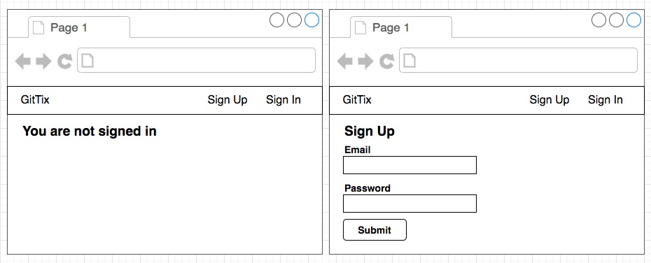


**[⬆ back to top](#table-of-contents)**

### Reminder on Server Side Rendering

Client Side Rendering


Server Side Rendering


**[⬆ back to top](#table-of-contents)**

### Basics of Next JS

- install react, react-dom, next
- create pages folder and add page components
- npm run dev

**[⬆ back to top](#table-of-contents)**

### Building a Next Image

```docker
FROM node:alpine

WORKDIR /app
COPY package.json .
RUN npm install
COPY . .

CMD ["npm", "run", "dev"]
```

```console
docker build -t chesterheng/client .
docker push chesterheng/client
```

**[⬆ back to top](#table-of-contents)**

### Running Next in Kubernetes

```yaml
# client-depl.yaml
apiVersion: apps/v1
kind: Deployment
metadata:
  name: client-depl
spec:
  replicas: 1
  selector:
    matchLabels:
      app: client
  template:
    metadata:
      labels:
        app: client
    spec:
      containers:
        - name: client
          image: chesterheng/client
---
apiVersion: v1
kind: Service
metadata:
  name: client-srv
spec:
  selector:
    app: client
  ports:
    - name: client
      protocol: TCP
      port: 3000
      targetPort: 3000
```

```yaml
# skaffold.yaml
apiVersion: skaffold/v2alpha3
kind: Config
deploy:
  kubectl:
    manifests:
      - ./infra/k8s/*
build:
  local:
    push: false
  artifacts:
    - image: chesterheng/auth
      context: auth
      docker:
        dockerfile: Dockerfile
      sync:
        manual:
          - src: 'src/**/*.ts'
            dest: .
    - image: chesterheng/client
      context: client
      docker:
        dockerfile: Dockerfile
      sync:
        manual:
          - src: '**/*.js'
            dest: .
```

```yaml
# ingress-srv.yaml
apiVersion: extensions/v1beta1
kind: Ingress
metadata:
  name: ingress-service
  annotations:
    kubernetes.io/ingress.class: nginx
    nginx.ingress.kubernetes.io/use-regex: 'true'
spec:
  rules:
    - host: ticketing.dev
      http:
        paths:
          - path: /api/users/?(.*)
            backend:
              serviceName: auth-srv
              servicePort: 3000
          - path: /?(.*)
            backend:
              serviceName: client-srv
              servicePort: 3000
```

```console
skaffold dev
```

- Goto chrome - https://ticketing.dev/
- Type 'thisisunsafe'

**[⬆ back to top](#table-of-contents)**

### Note on File Change Detection

```javascript
// next.config.js
module.exports = {
  webpackDevMiddleware: config => {
    config.watchOptons.poll = 300;
    return config;
  }
};
```

```console
kubectl get pods
kubectl delete pod client-depl-b955695bf-8ws8j
kubectl get pods
```

**[⬆ back to top](#table-of-contents)**

### Adding Global CSS

[Global CSS Must Be in Your Custom <App>](https://github.com/vercel/next.js/blob/canary/errors/css-global.md)

```javascript
// _app.js
import 'bootstrap/dist/css/bootstrap.css';

export default ({ Component, pageProps }) => {
  return <Component {...pageProps} />;
};
```

**[⬆ back to top](#table-of-contents)**

### Adding a Sign Up Form

```javascript
// signup.js
export default () => {
  return (
    <form>
      <h1>Sign Up</h1>
      <div className="form-group">
        <label>Email Address</label>
        <input className="form-control" />
      </div>
      <div className="form-group">
        <label>Password</label>
        <input type="password" className="form-control" />
      </div>
      <button className="btn btn-primary">Sign Up</button>
    </form>
  );
};
```

**[⬆ back to top](#table-of-contents)**

### Handling Email and Password Inputs

```javascript
// signup.js
import { useState } from 'react';

export default () => {
  const [email, setEmail] = useState('');
  const [password, setPassword] = useState('');

  const onSubmit = event => {
    event.preventDefault();

    console.log(email, password);
  };

  return (
    <form onSubmit={onSubmit}>
      <h1>Sign Up</h1>
      <div className="form-group">
        <label>Email Address</label>
        <input
          value={email}
          onChange={e => setEmail(e.target.value)}
          className="form-control"
        />
      </div>
      <div className="form-group">
        <label>Password</label>
        <input
          value={password}
          onChange={e => setPassword(e.target.value)}
          type="password"
          className="form-control"
        />
      </div>
      <button className="btn btn-primary">Sign Up</button>
    </form>
  );
};
```

**[⬆ back to top](#table-of-contents)**

### Successful Account Signup

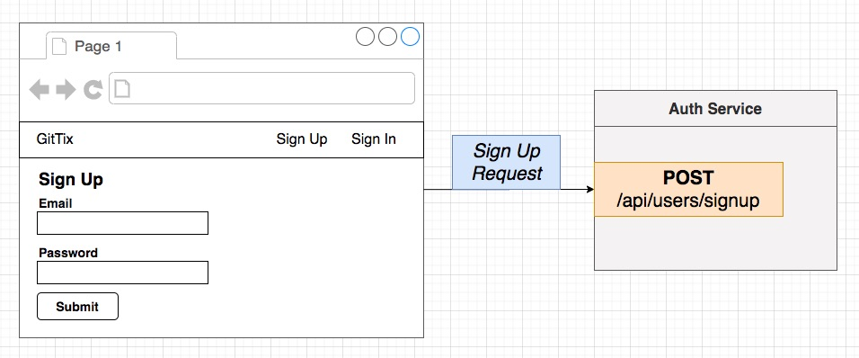

```javascript
// signup.js
const onSubmit = async event => {
  event.preventDefault();

  const response = await axios.post('/api/users/signup', {
    email,
    password
  });

  console.log(response.data);
};
```

**[⬆ back to top](#table-of-contents)**

### Handling Validation Errors

```javascript
// signup.js
const [errors, setErrors] = useState([]);

const onSubmit = async event => {
  event.preventDefault();

  try {
    const response = await axios.post('/api/users/signup', {
      email,
      password
    });

    console.log(response.data);
  } catch (err) {
    setErrors(err.response.data.errors);
  }
};
```

**[⬆ back to top](#table-of-contents)**

### The useRequest Hook

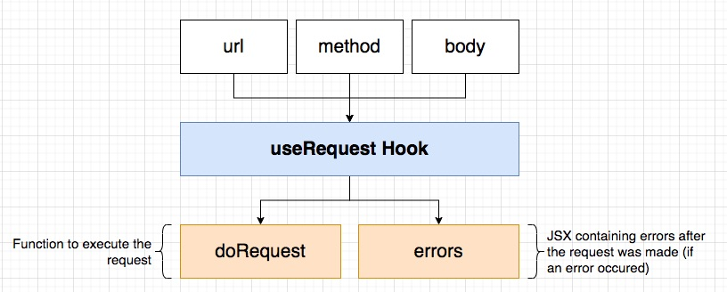

```javascript
// use-request.js
import axios from 'axios';
import { useState } from 'react';

export default ({ url, method, body }) => {
  const [errors, setErrors] = useState(null);

  const doRequest = async () => {
    try {
      setErrors(null);
      const response = await axios[method](url, body);
      return response.data;
    } catch (err) {
      setErrors(
        <div className="alert alert-danger">
          <h4>Ooops....</h4>
          <ul className="my-0">
            {err.response.data.errors.map(err => (
              <li key={err.message}>{err.message}</li>
            ))}
          </ul>
        </div>
      );
    }
  };

  return { doRequest, errors };
};
```

**[⬆ back to top](#table-of-contents)**

### Using the useRequest Hook

```javascript
// signup.js
const { doRequest, errors } = useRequest({
  url: '/api/users/signup',
  method: 'post',
  body: {
    email, password
  }
})

const onSubmit = async event => {
  event.preventDefault();

  doRequest();
};
```

**[⬆ back to top](#table-of-contents)**

### An onSuccess Callback

```javascript
// use-request.js
import axios from 'axios';
import { useState } from 'react';

export default ({ url, method, body, onSuccess }) => {
  const [errors, setErrors] = useState(null);

  const doRequest = async () => {
    try {
      setErrors(null);
      const response = await axios[method](url, body);

      if (onSuccess) {
        onSuccess(response.data);
      }

      return response.data;
    } catch (err) {
      setErrors(
        <div className="alert alert-danger">
          <h4>Ooops....</h4>
          <ul className="my-0">
            {err.response.data.errors.map(err => (
              <li key={err.message}>{err.message}</li>
            ))}
          </ul>
        </div>
      );
    }
  };

  return { doRequest, errors };
};
```

```javascript
// signup.js
const { doRequest, errors } = useRequest({
  url: '/api/users/signup',
  method: 'post',
  body: {
    email, password
  },
  onSuccess: () => Router.push('/')
})

const onSubmit = async event => {
  event.preventDefault();

  await doRequest();
};
```

**[⬆ back to top](#table-of-contents)**

### Overview on Server Side Rendering


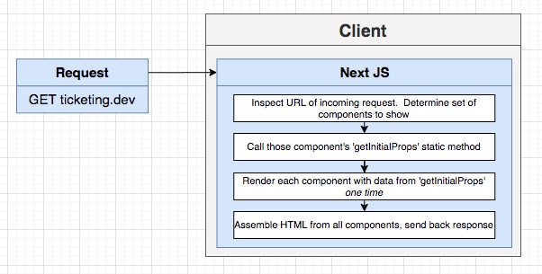

```javascript
// index.js
const LandingPage = ({ color }) => {
  console.log('I am in the component', color);
  return <h1>Landing Page</h1>;
};

LandingPage.getInitialProps = () => {
  console.log('I am on the server!');

  return { color: 'red' };
};

export default LandingPage;
```

**[⬆ back to top](#table-of-contents)**

### Fetching Data During SSR

```javascript
LandingPage.getInitialProps = async () => {
  const response = await axios.get('/api/users/currentuser');

  return response.data;
};
```

**[⬆ back to top](#table-of-contents)**

### Why the Error?

```javascript
const LandingPage = ({ currentUser }) => {
  console.log(currentUser);
  axios.get('/api/users/currentuser');

  return <h1>Landing Page</h1>;
};
```

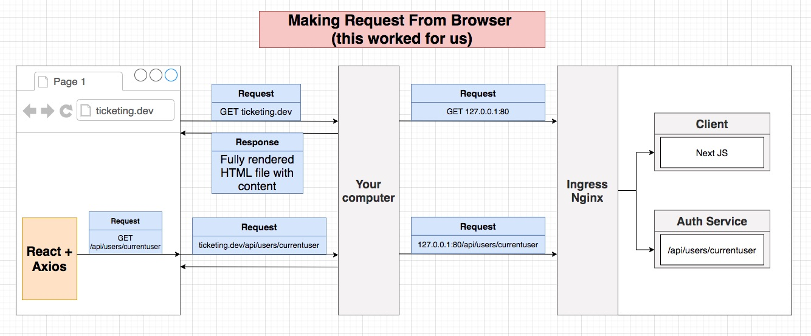

```javascript
LandingPage.getInitialProps = async () => {
  const response = await axios.get('/api/users/currentuser');

  return response.data;
};
```


**[⬆ back to top](#table-of-contents)**

### Two Possible Solutions

Request Option #1 is selected


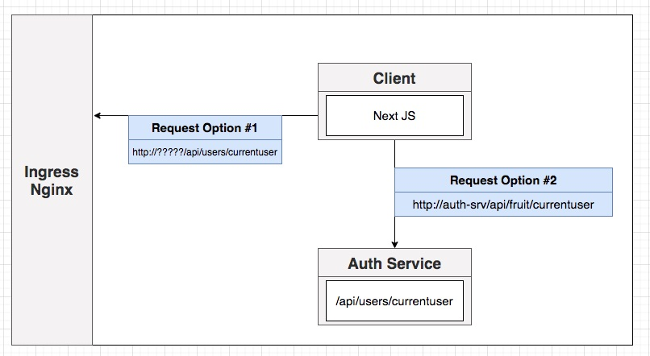
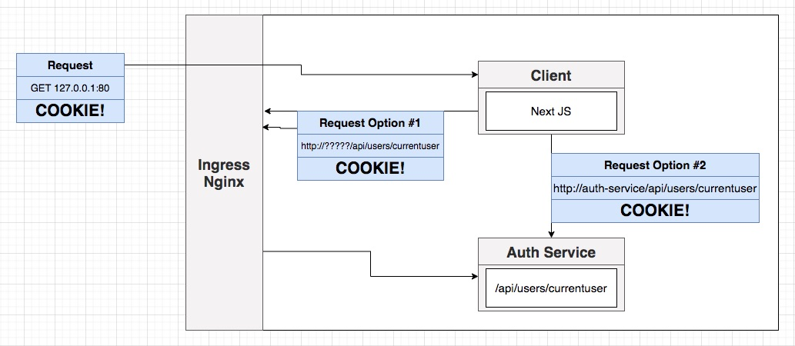

**[⬆ back to top](#table-of-contents)**

### Cross Namespace Service Communication

Request Option #1 is selected

```console
kubectl get services -n ingress-nginx
kubectl get namespace
```

- service.namespace.svc.cluster.local
- http://ingress-nginx-controller.ingress-nginx.svc.cluster.local

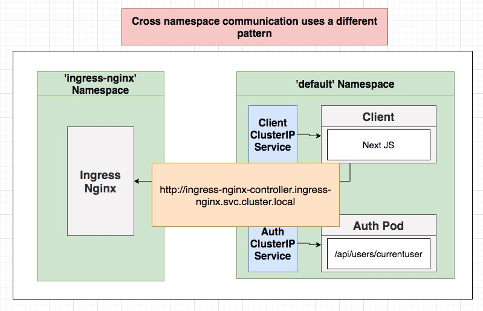


Optional

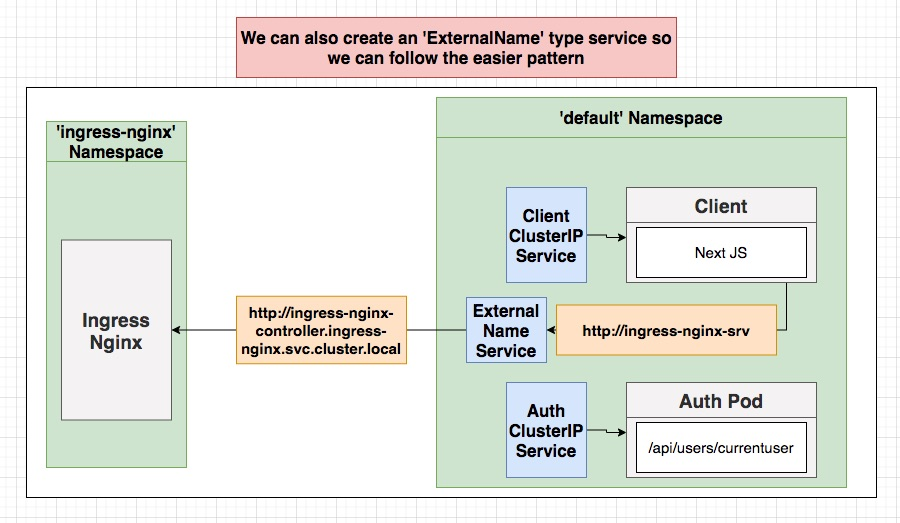

**[⬆ back to top](#table-of-contents)**

### When is GetInitialProps Called?


| Request from a component                              | Request from getInitialProps                                                                                          |
| ----------------------------------------------------- | --------------------------------------------------------------------------------------------------------------------- |
| Always issued from the browser, so use a domain of '' | Might be executed from the client or the server!  Need to figure out what our env is so we can use the correct domain |

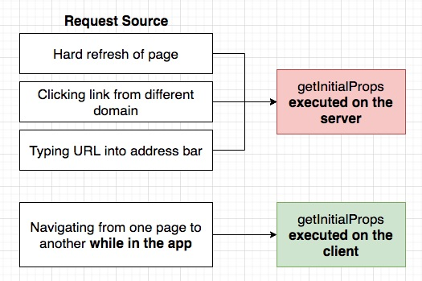

**[⬆ back to top](#table-of-contents)**

### On the Server or the Browser

```javascript
LandingPage.getInitialProps = async () => {
  if(typeof window === 'undefined') {
    // we are on the server!
    // requests should be made to http://ingress-nginx-controller.ingress-nginx.svc.cluster.local
  } else {
    // we are on the browser!
    // requests should be made with a base url of ''
  }
  return {};
};
```

**[⬆ back to top](#table-of-contents)**

### Specifying the Host

```console
kubectl get services -n ingress-nginx
kubectl get namespace
```

- service.namespace.svc.cluster.local
- http://ingress-nginx-controller.ingress-nginx.svc.cluster.local

```javascript
LandingPage.getInitialProps = async () => {
  if(typeof window === 'undefined') {
    // we are on the server!
    // requests should be made to http://ingress-nginx-controller.ingress-nginx.svc.cluster.local
    const { data } = await axios.get(
      'http://ingress-nginx-controller.ingress-nginx.svc.cluster.local/api/users/currentuser',
      {
        headers: {
          Host: 'ticketing.dev'
        }
      }
    );

    return data;
  } else {
    // we are on the browser!
    // requests should be made with a base url of ''
    const { data } = await axios.get('/api/users/currentuser');
    
    return data;
  }
  return {};
};
```

**[⬆ back to top](#table-of-contents)**

### Passing Through the Cookies

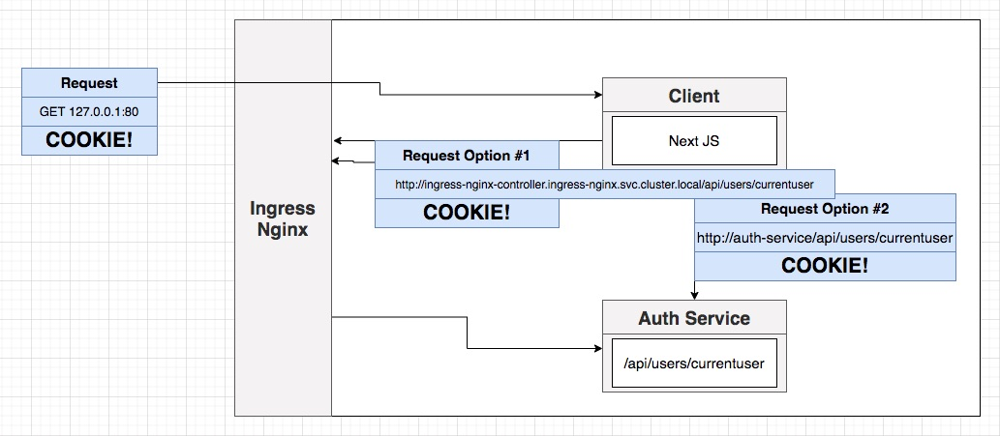

```javascript
LandingPage.getInitialProps = async ({ req }) => {
  if(typeof window === 'undefined') {
    // we are on the server!
    // requests should be made to http://ingress-nginx-controller.ingress-nginx.svc.cluster.local
    const { data } = await axios.get(
      'http://ingress-nginx-controller.ingress-nginx.svc.cluster.local/api/users/currentuser',
      {
        headers: req.headers
      }
    );

    return data;
  } else { ... }
  return {};
};
```

**[⬆ back to top](#table-of-contents)**

### A Reusable API Client

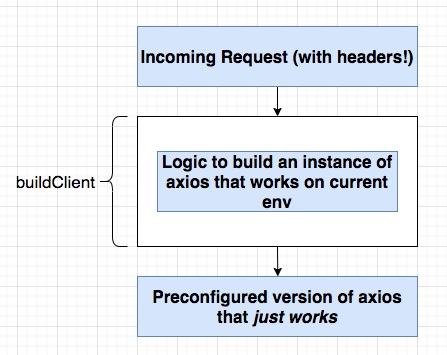

```javascript
// build-client.js
import axios from 'axios';

export default ({ req }) => {
  if(typeof window === 'undefined') {
    // we are on the server

    return axios.create({
      baseURL: 'http://ingress-nginx-controller.ingress-nginx.svc.cluster.local',
      headers: req.headers
    });
  } else {
    // we are on the browser

    return axios.create({
      baseURL: ''
    });
  }
};
```

```javascript
// index.js
LandingPage.getInitialProps = async (context) => {
  const client = buildClient(context);
  const { data } = await client.get('/api/users/currentuser');

  return data;
};
```

**[⬆ back to top](#table-of-contents)**

### Content on the Landing Page

```javascript
const LandingPage = ({ currentUser }) => {
  return currentUser ? (
    <h1>You are signed in</h1>
  ) : (
    <h1>You are NOT signed in</h1>
  );
};
```

**[⬆ back to top](#table-of-contents)**

### The Sign In Form

```javascript
// signin.js
import { useState, useEffect } from 'react';
import Router from 'next/router';
import useRequest from '../../hooks/use-request';

export default () => {
  const [email, setEmail] = useState('');
  const [password, setPassword] = useState('');
  const { doRequest, errors } = useRequest({
    url: '/api/users/signin',
    method: 'post',
    body: {
      email,
      password
    },
    onSuccess: () => Router.push('/')
  });

  const onSubmit = async event => {
    event.preventDefault();

    await doRequest();
  };

  return (
    <form onSubmit={onSubmit}>
      <h1>Sign In</h1>
      <div className="form-group">
        <label>Email Address</label>
        <input
          value={email}
          onChange={e => setEmail(e.target.value)}
          className="form-control"
        />
      </div>
      <div className="form-group">
        <label>Password</label>
        <input
          value={password}
          onChange={e => setPassword(e.target.value)}
          type="password"
          className="form-control"
        />
      </div>
      {errors}
      <button className="btn btn-primary">Sign In</button>
    </form>
  );
};
```

**[⬆ back to top](#table-of-contents)**

### A Reusable Header

```javascript
// _app.js
import 'bootstrap/dist/css/bootstrap.css';

export default ({ Component, pageProps }) => {
  return (
    <div>
      <h1>Header!</h1>
      <Component {...pageProps} />
    </div>
  );
};
```

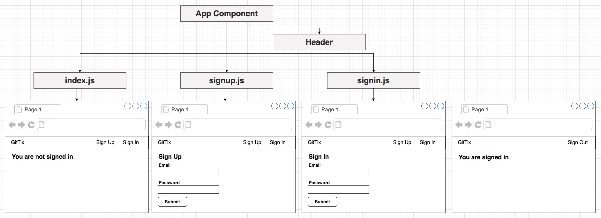
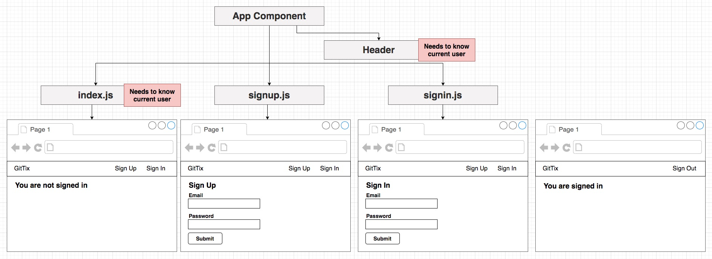
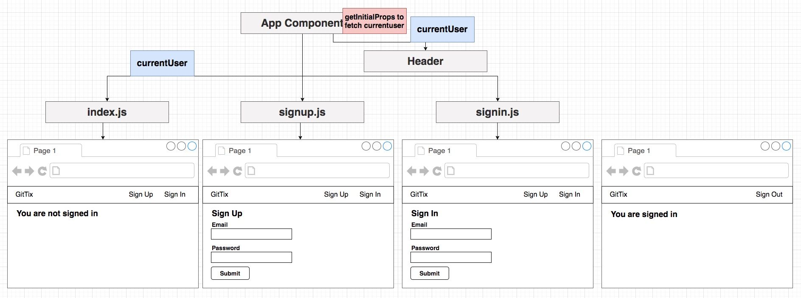
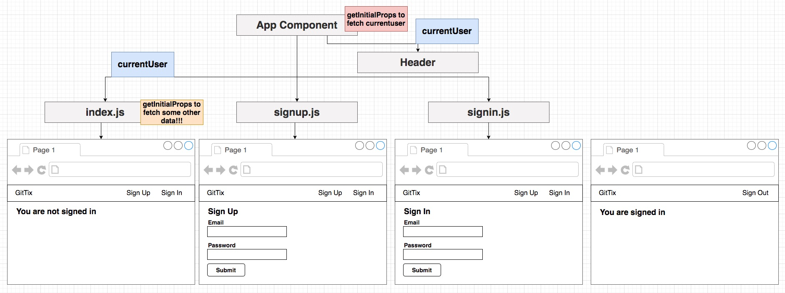

**[⬆ back to top](#table-of-contents)**

### Moving GetInitialProps

```javascript
// _app.js
import 'bootstrap/dist/css/bootstrap.css';
import buildClient from '../api/build-client';

const AppComponent = ({ Component, pageProps }) => {
  return (
    <div>
      <h1>Header!</h1>
      <Component {...pageProps} />
    </div>
  );
};

AppComponent.getInitialProps = () => {};

export default AppComponent;
```

**[⬆ back to top](#table-of-contents)**

### Issues with Custom App GetInitialProps

- LandingPage.getInitialProps is not invoked the moment we add AppComponent.getInitialProps

```javascript
AppComponent.getInitialProps = async appContext => {
  const client = buildClient(appContext.ctx);
  const { data } = await client.get('/api/users/currentuser');

  return data;
};
```

**[⬆ back to top](#table-of-contents)**

### Handling Multiple GetInitialProps
**[⬆ back to top](#table-of-contents)**

### Passing Props Through
**[⬆ back to top](#table-of-contents)**

### Building the Header
**[⬆ back to top](#table-of-contents)**

### Conditionally Showing Links
**[⬆ back to top](#table-of-contents)**

### Signing Out
**[⬆ back to top](#table-of-contents)**

### React App Catchup
**[⬆ back to top](#table-of-contents)**
