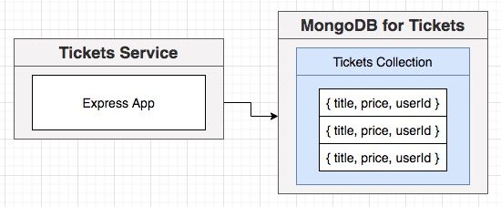
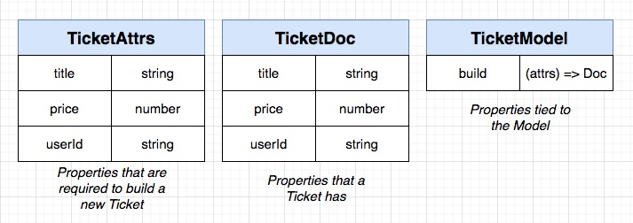

## **Section 13: Create-Read-Update-Destroy Server Setup**

## Table of Contents
- [**Section 13: Create-Read-Update-Destroy Server Setup**](#section-13-create-read-update-destroy-server-setup)
- [Table of Contents](#table-of-contents)
  - [Ticketing Service Overview](#ticketing-service-overview)
  - [Project Setup](#project-setup)
  - [Running the Ticket Service](#running-the-ticket-service)
  - [Mongo Connection URI](#mongo-connection-uri)
  - [Quick Auth Update](#quick-auth-update)
  - [Test-First Approach](#test-first-approach)
  - [Creating the Router](#creating-the-router)
  - [Adding Auth Protection](#adding-auth-protection)
  - [Faking Authentication During Tests](#faking-authentication-during-tests)
  - [Building a Session](#building-a-session)
  - [Testing Request Validation](#testing-request-validation)
  - [Validating Title and Price](#validating-title-and-price)
  - [Reminder on Mongoose with TypeScript](#reminder-on-mongoose-with-typescript)
  - [Defining the Ticket Model](#defining-the-ticket-model)
  - [Creation via Route Handler](#creation-via-route-handler)
  - [Testing Show Routes](#testing-show-routes)
  - [Unexpected Failure!](#unexpected-failure)
  - [What's that Error?!](#whats-that-error)
  - [Better Error Logging](#better-error-logging)
  - [Complete Index Route Implementation](#complete-index-route-implementation)
  - [Ticket Updating](#ticket-updating)
  - [Handling Updates](#handling-updates)
  - [Permission Checking](#permission-checking)
  - [Final Update Changes](#final-update-changes)
  - [Manual Testing](#manual-testing)

### Ticketing Service Overview




Steps

- Create package.json, install deps
- Write Dockerfile
- Create index.ts to run project
- Build image, push to docker hub
- Write k8s file for deployment, service
- Update skaffold.yaml to do file sync for tickets
- Write k8s file for Mongodb deployment, service

Copy from auth service to save time!

- Create package.json, install deps
- Write Dockerfile
- Create index.ts to run project

**[⬆ back to top](#table-of-contents)**

### Project Setup

- Build image, push to docker hub

```console
docker build -t chesterheng/tickets .
docker push chesterheng/tickets
```

**[⬆ back to top](#table-of-contents)**

### Running the Ticket Service

- Write k8s file for deployment, service
- Update skaffold.yaml to do file sync for tickets
- Write k8s file for Mongodb deployment, service

```console
kubectl get pods
cd section-13/ticketing
skaffold dev
```

**[⬆ back to top](#table-of-contents)**

### Mongo Connection URI

```yaml
- name: MONGO_URI
  value: 'mongodb://tickets-mongo-srv:27017/tickets'
```

```typescript
try {
  await mongoose.connect(process.env.MONGO_URI, {
    useNewUrlParser: true,
    useUnifiedTopology: true,
    useCreateIndex: true
  });
  console.log('Connected to MongoDb');
} catch (err) {
  console.log(err);
}
```

**[⬆ back to top](#table-of-contents)**

### Quick Auth Update

```yaml
- name: MONGO_URI
  value: 'mongodb://auth-mongo-srv:27017/auth'
```

```typescript
try {
  await mongoose.connect(process.env.MONGO_URI, {
    useNewUrlParser: true,
    useUnifiedTopology: true,
    useCreateIndex: true
  });
  console.log('Connected to MongoDb');
} catch (err) {
  console.log(err);
}
```

**[⬆ back to top](#table-of-contents)**

### Test-First Approach

```typescript
import request from 'supertest';
import { app } from '../../app';

it('has a route handler listening to /api/tickets for post requests', async () => {});

it('can only be accessed if the user is signed in', async () => {});

it('returns an error if an invalid title is provided', async () => {});

it('returns an error if an invalid price is provided', async () => {});

it('creates a ticket with valid inputs', async () => {});
```

**[⬆ back to top](#table-of-contents)**

### Creating the Router

```typescript
it('has a route handler listening to /api/tickets for post requests', async () => {
  const response = await request(app)
    .post('/api/tickets')
    .send({});

  expect(response.status).not.toEqual(404);
});
```

```typescript
import express, { Request, Response } from 'express';

const router = express.Router();

router.post('/api/tickets', (req: Request, res: Response) => {
  res.sendStatus(200);
});

export { router as createTicketRouter };
```

```typescript
app.use(createTicketRouter);
```

**[⬆ back to top](#table-of-contents)**

### Adding Auth Protection

```typescript
it('can only be accessed if the user is signed in', async () => {
  await request(app).post('/api/tickets').send({}).expect(401);
});
```

```typescript
app.use(currentUser);
```

```typescript
import express, { Request, Response } from 'express';
import { requireAuth } from '@chticketing/common';

const router = express.Router();

router.post('/api/tickets', requireAuth, (req: Request, res: Response) => {
  res.sendStatus(200);
});

export { router as createTicketRouter };
```

**[⬆ back to top](#table-of-contents)**

### Faking Authentication During Tests

```typescript
it('returns a status other than 401 if the user is signed in', async () => {
  const response = await request(app).post('/api/tickets').send({});

  expect(response.status).not.toEqual(401);
});
```

cookie: express:sess=eyJqd3QiOiJleUpoYkdjaU9pSklVekkxTmlJc0luUjVjQ0k2SWtwWFZDSjkuZXlKcFpDSTZJalZtTVRRd016Y3lPRFUyWkdRek1EQXhPV1U1TkdFd1pTSXNJbVZ0WVdsc0lqb2lkR1Z6ZEVCMFpYTjBMbU52YlNJc0ltbGhkQ0k2TVRVNU5URTBOekV5TW4wLkVicVlVVmY5SjIyUjlOa3k5dVhKdHl3WEh2MVI4ZURuQUlSWFl3RWw4UkEifQ==

https://www.base64decode.org/

- Build a JWT payload. { id, email }
- Create the JWT!
- Build Session object. { jwt: MY_JWT }
- Turn that session into JSON
- Take JSON and encode it as base64
- return a string thats the cookie with encoded data

**[⬆ back to top](#table-of-contents)**

### Building a Session

```typescript
it('returns a status other than 401 if the user is signed in', async () => {
  const response = await request(app)
    .post('/api/tickets')
    .set('Cookie', global.signin())
    .send({});

  expect(response.status).not.toEqual(401);
});
```

```typescript
global.signin = () => {
  // Build a JWT payload. { id, email }
  const payload = {
    id: "5f140372856dd30019e94a0e",
    email: "test@test.com"
  }

  // Create the JWT!
  const token = jwt.sign(payload, process.env.JWT_KEY!);

  // Build Session object. { jwt: MY_JWT }
  const session = { jwt: token }

  // Turn that session into JSON
  const sessionJSON = JSON.stringify(session);

  // Take JSON and encode it as base64
  const base64 = Buffer.from(sessionJSON).toString('base64');

  // return a string thats the cookie with encoded data
  return [`express:sess=${base64}`];
};
```

**[⬆ back to top](#table-of-contents)**

### Testing Request Validation

```typescript
it('returns an error if an invalid title is provided', async () => {
  await request(app)
    .post('/api/tickets')
    .set('Cookie', global.signin())
    .send({
      title: '',
      price: 10,
    })
    .expect(400);

  await request(app)
    .post('/api/tickets')
    .set('Cookie', global.signin())
    .send({
      price: 10,
    })
    .expect(400);
});

it('returns an error if an invalid price is provided', async () => {
  await request(app)
    .post('/api/tickets')
    .set('Cookie', global.signin())
    .send({
      title: 'asldkjf',
      price: -10,
    })
    .expect(400);

  await request(app)
    .post('/api/tickets')
    .set('Cookie', global.signin())
    .send({
      title: 'laskdfj',
    })
    .expect(400);
});
```

**[⬆ back to top](#table-of-contents)**

### Validating Title and Price

```typescript
import express, { Request, Response } from 'express';
import { body } from 'express-validator';
import { requireAuth, validateRequest } from '@chticketing/common';

const router = express.Router();

router.post(
  '/api/tickets',
  requireAuth,
  [
    body('title').not().isEmpty().withMessage('Title is required'),
    body('price')
      .isFloat({ gt: 0 })
      .withMessage('Price must be greater than 0'),
  ],
  validateRequest,
  (req: Request, res: Response) => {
    res.sendStatus(200);
  }
);

export { router as createTicketRouter };
```

**[⬆ back to top](#table-of-contents)**

### Reminder on Mongoose with TypeScript



```typescript
import mongoose from 'mongoose';

interface TicketAttrs {
  title: string;
  price: number;
  userId: string;
}

interface TicketDoc extends mongoose.Document {
  title: string;
  price: number;
  userId: string;
}

interface TicketModel extends mongoose.Model<TicketDoc> {
  build(attrs: TicketAttrs): TicketDoc;
}
```

**[⬆ back to top](#table-of-contents)**

### Defining the Ticket Model
**[⬆ back to top](#table-of-contents)**

### Creation via Route Handler
**[⬆ back to top](#table-of-contents)**

### Testing Show Routes
**[⬆ back to top](#table-of-contents)**

### Unexpected Failure!
**[⬆ back to top](#table-of-contents)**

### What's that Error?!
**[⬆ back to top](#table-of-contents)**

### Better Error Logging
**[⬆ back to top](#table-of-contents)**

### Complete Index Route Implementation
**[⬆ back to top](#table-of-contents)**

### Ticket Updating
**[⬆ back to top](#table-of-contents)**

### Handling Updates
**[⬆ back to top](#table-of-contents)**

### Permission Checking
**[⬆ back to top](#table-of-contents)**

### Final Update Changes
**[⬆ back to top](#table-of-contents)**

### Manual Testing
**[⬆ back to top](#table-of-contents)**