## **Section 14: NATS Streaming Server - An Event Bus Implementation**

## Table of Contents
- [**Section 14: NATS Streaming Server - An Event Bus Implementation**](#section-14-nats-streaming-server---an-event-bus-implementation)
- [Table of Contents](#table-of-contents)
  - [What Now?](#what-now)
  - [Three Important Items](#three-important-items)
  - [Creating a NATS Streaming Deployment](#creating-a-nats-streaming-deployment)
  - [Big Notes on NATS Streaming](#big-notes-on-nats-streaming)
  - [Building a NATS Test Project](#building-a-nats-test-project)
  - [Port-Forwarding with Kubectl](#port-forwarding-with-kubectl)
  - [Publishing Events](#publishing-events)
  - [Listening For Data](#listening-for-data)
  - [Accessing Event Data](#accessing-event-data)
  - [Client ID Generation](#client-id-generation)
  - [Queue Groups](#queue-groups)
  - [Manual Ack Mode](#manual-ack-mode)
  - [Client Health Checks](#client-health-checks)
  - [Graceful Client Shutdown](#graceful-client-shutdown)
  - [Core Concurrency Issues](#core-concurrency-issues)
  - [Common Questions](#common-questions)
  - [Solving Concurrency Issues](#solving-concurrency-issues)
  - [Concurrency Control with the Tickets App](#concurrency-control-with-the-tickets-app)
  - [Event Redelivery](#event-redelivery)
  - [Durable Subscriptions](#durable-subscriptions)

### What Now?

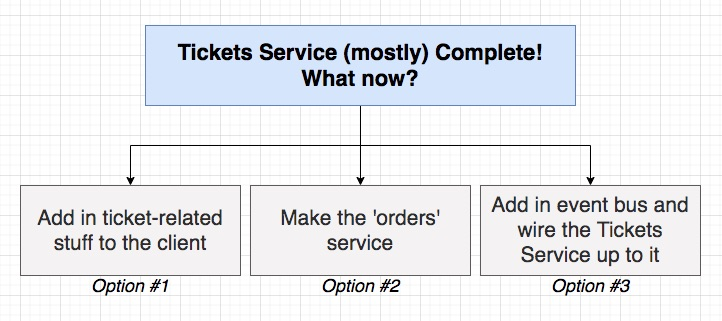
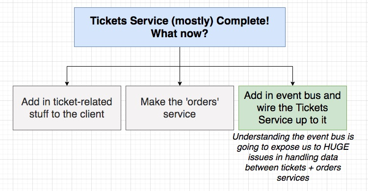
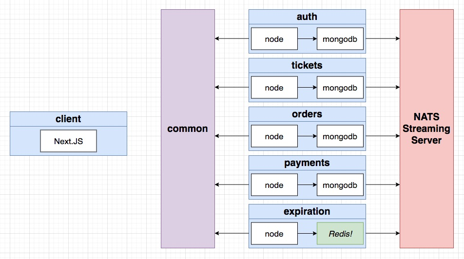

**[⬆ back to top](#table-of-contents)**

### Three Important Items

NATS Streaming Server

- Docs at: docs.nats.io
- NATS and NATS Streaming Server are two different things
  - [NATS Streaming Concepts](https://docs.nats.io/nats-streaming-concepts/intro)
- NATS Streaming implements some extraordinarily important design decisions that will affect our app
- We are going to run the official '[nats-streaming](https://hub.docker.com/_/nats-streaming)' docker image in kubernetes.  
  - Need to read the image's docs: Commandline Options

**[⬆ back to top](#table-of-contents)**

### Creating a NATS Streaming Deployment

```yaml
apiVersion: apps/v1
kind: Deployment
metadata:
  name: nats-depl
spec:
  replicas: 1
  selector:
    matchLabels:
      app: nats
  template:
    metadata:
      labels:
        app: nats
    spec:
      containers:
        - name: nats
          image: nats-streaming:0.17.0
          args:
            [
              '-p',
              '4222',
              '-m',
              '8222',
              '-hbi',
              '5s',
              '-hbt',
              '5s',
              '-hbf',
              '2',
              '-SD',
              '-cid',
              'ticketing',
            ]
---
apiVersion: v1
kind: Service
metadata:
  name: nats-srv
spec:
  selector:
    app: nats
  ports:
    - name: client
      protocol: TCP
      port: 4222
      targetPort: 4222
    - name: monitoring
      protocol: TCP
      port: 8222
      targetPort: 8222
```

```console
cd section-14/ticketing
skaffold dev
kubectl get pods
```

**[⬆ back to top](#table-of-contents)**

### Big Notes on NATS Streaming

[Stan.js - Node.js client for NATS Streaming](https://github.com/nats-io/stan.js)

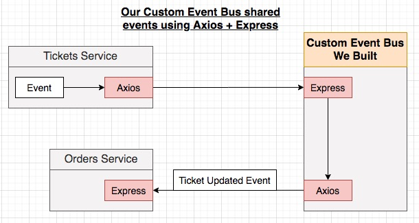
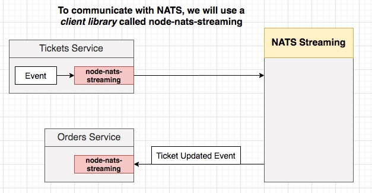

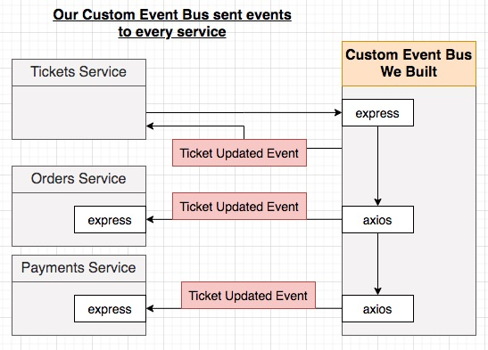
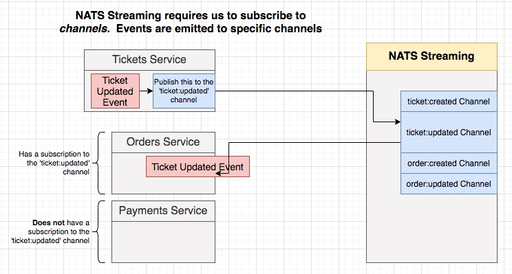


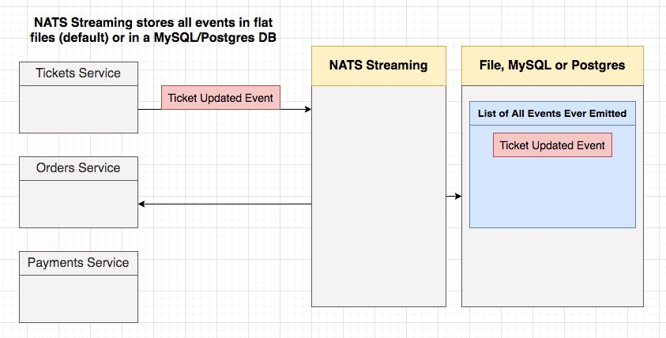

**[⬆ back to top](#table-of-contents)**

### Building a NATS Test Project

Short Term Goal

- Create a new sub-project with typescript support
- Install node-nats-streaming library and connect to nats streaming server
- We should have two npm scripts, one to run code to emit events, and one to run code to listen for events
- This program will be ran outside of kubernetes!

```typescript
// publisher.ts
import nats from 'node-nats-streaming';

const stan = nats.connect('ticketing', 'abc', {
  url: 'http://localhost:4222',
});

stan.on('connect', () => {
  console.log('Publisher connected to NATS');
});
```

**[⬆ back to top](#table-of-contents)**

### Port-Forwarding with Kubectl

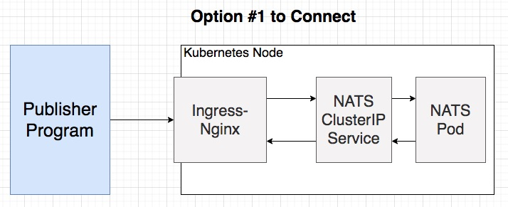
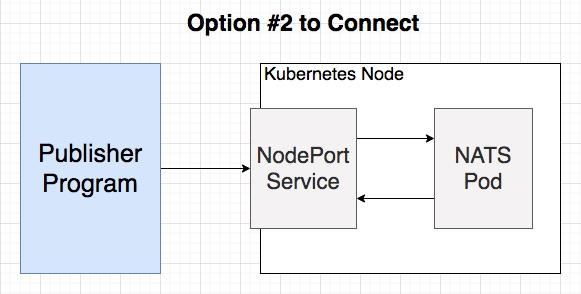
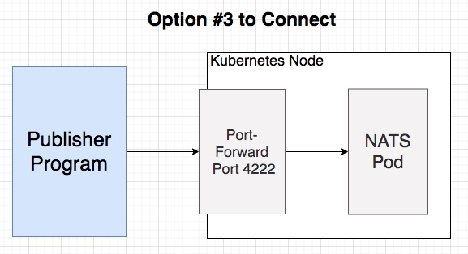

- Option #3 is selected for small test program

```console
kubectl get pods
kubectl port-forward nats-depl-77998c944-fjzkq 4222:4222
cd section-14/ticketing/nats-test
npm run publish
```

**[⬆ back to top](#table-of-contents)**

### Publishing Events


```typescript
// publisher.ts
import nats from 'node-nats-streaming';

const stan = nats.connect('ticketing', 'abc', {
  url: 'http://localhost:4222',
});

stan.on('connect', () => {
  console.log('Publisher connected to NATS');

  const data = JSON.stringify({
    id: '123',
    title: 'concert',
    price: 20
  });

  stan.publish('ticket:created', data, () => {
    console.log('Event published');
  })
});
```

**[⬆ back to top](#table-of-contents)**

### Listening For Data

```typescript
// listener.ts
import nats from 'node-nats-streaming';

console.clear();

const stan = nats.connect('ticketing', '123', {
  url: 'http://localhost:4222',
});

stan.on('connect', () => {
  console.log('Listener connected to NATS');

  const subscription = stan.subscribe('ticket:created');

  subscription.on('message', (msg) => {
    console.log('Message recieved');
  });
});
```

- split screen to watch both publisher and listener

- type rs and enter to re-start publisher


**[⬆ back to top](#table-of-contents)**

### Accessing Event Data

```typescript
import nats, { Message } from 'node-nats-streaming';

console.clear();

const stan = nats.connect('ticketing', '123', {
  url: 'http://localhost:4222',
});

stan.on('connect', () => {
  console.log('Listener connected to NATS');

  const subscription = stan.subscribe('ticket:created');

  subscription.on('message', (msg: Message) => {
    const data = msg.getData();

    if (typeof data === 'string') {
      console.log(`Received event #${msg.getSequence()}, with data: ${data}`);
    }
  });
});
```

**[⬆ back to top](#table-of-contents)**

### Client ID Generation
**[⬆ back to top](#table-of-contents)**

### Queue Groups
**[⬆ back to top](#table-of-contents)**

### Manual Ack Mode
**[⬆ back to top](#table-of-contents)**

### Client Health Checks
**[⬆ back to top](#table-of-contents)**

### Graceful Client Shutdown
**[⬆ back to top](#table-of-contents)**

### Core Concurrency Issues
**[⬆ back to top](#table-of-contents)**

### Common Questions
**[⬆ back to top](#table-of-contents)**

279. [Optional] More Possible Concurrency Solutions
**[⬆ back to top](#table-of-contents)**

### Solving Concurrency Issues
**[⬆ back to top](#table-of-contents)**

### Concurrency Control with the Tickets App
**[⬆ back to top](#table-of-contents)**

### Event Redelivery
**[⬆ back to top](#table-of-contents)**

### Durable Subscriptions
**[⬆ back to top](#table-of-contents)**