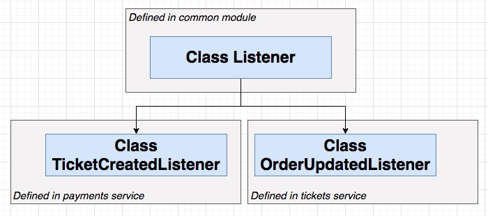
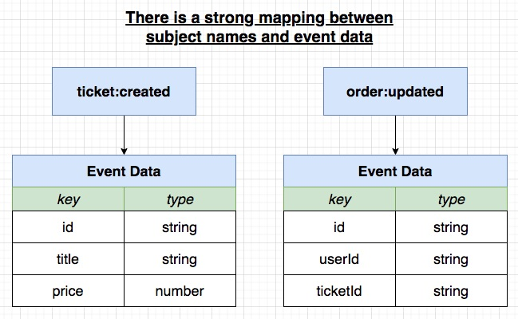
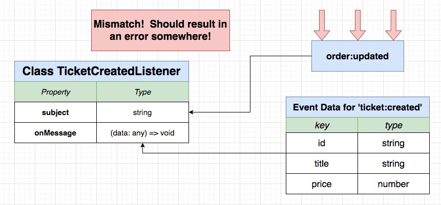
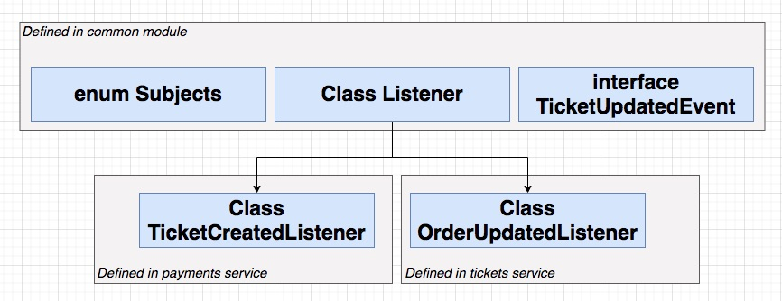

## **Section 15: Connecting to NATS in a Node JS World**

## Table of Contents
- [**Section 15: Connecting to NATS in a Node JS World**](#section-15-connecting-to-nats-in-a-node-js-world)
- [Table of Contents](#table-of-contents)
  - [Reusable NATS Listeners](#reusable-nats-listeners)
  - [The Listener Abstract Class](#the-listener-abstract-class)
  - [Extending the Listener](#extending-the-listener)
  - [Quick Refactor](#quick-refactor)
  - [Leveraging TypeScript for Listener Validation](#leveraging-typescript-for-listener-validation)
  - [Subjects Enum](#subjects-enum)
  - [Custom Event Interface](#custom-event-interface)
  - [Enforcing Listener Subjects](#enforcing-listener-subjects)
  - [Quick Note: 'readonly' in Typescript](#quick-note-readonly-in-typescript)
  - [Enforcing Data Types](#enforcing-data-types)
  - [Where Does this Get Used?](#where-does-this-get-used)
  - [Custom Publisher](#custom-publisher)
  - [Using the Custom Publisher](#using-the-custom-publisher)
  - [Awaiting Event Publication](#awaiting-event-publication)
  - [Common Event Definitions Summary](#common-event-definitions-summary)
  - [Updating the Common Module](#updating-the-common-module)
  - [Restarting NATS](#restarting-nats)

### Reusable NATS Listeners

- Wow, this is a lot of boilerplate to publish/receive a message!
- Let's try to refactor this to make it much easier to publish/receive
- We'll write out an initial implementation in this test project, then move it to our common module


**[⬆ back to top](#table-of-contents)**

### The Listener Abstract Class


```typescript
abstract class Listener {
  abstract subject: string;
  abstract queueGroupName: string;
  abstract onMessage(data: any, msg: Message): void;
  private client: Stan;
  protected ackWait = 5 * 1000;

  constructor(client: Stan) {
    this.client = client;
  }

  subscriptionOptions() {
    return this.client
    .subscriptionOptions()
    .setDeliverAllAvailable()
    .setManualAckMode(true)
    .setAckWait(this.ackWait)
    .setDurableName(this.queueGroupName);
  }

  listen() {
    const subscription = this.client.subscribe(
      this.subject,
      this.queueGroupName,
      this.subscriptionOptions()
    )

    subscription.on('message', (msg: Message) => {
      console.log(`Message received: ${this.subject} / ${this.queueGroupName}`);

      const parsedData = this.parseMessage(msg);
      this.onMessage(parsedData, msg);
    })
  }

  parseMessage(msg: Message) {
    const data = msg.getData();
    return typeof data === 'string'
      ? JSON.parse(data)
      : JSON.parse(data.toString('utf8'))
  }
}
```

**[⬆ back to top](#table-of-contents)**

### Extending the Listener


```typescript
class TicketCreatedListener extends Listener {
  subject = 'ticket:created';
  queueGroupName = 'payments-service';

  onMessage(data: any, msg: Message) {
    console.log('Event data!', data);

    msg.ack();
  }
}
```

**[⬆ back to top](#table-of-contents)**

### Quick Refactor



```typescript
// listener.ts
import nats from 'node-nats-streaming';
import { randomBytes } from 'crypto';
import { TicketCreatedListener } from './events/ticket-created-listener';

console.clear();

const stan = nats.connect('ticketing', randomBytes(4).toString('hex'), {
  url: 'http://localhost:4222',
});

stan.on('connect', () => {
  console.log('Listener connected to NATS');

  stan.on('close', () => {
    console.log('NATS connection closed!');
    process.exit();
  });

  new TicketCreatedListener(stan).listen();
});

process.on('SIGINT', () => stan.close());
process.on('SIGTERM', () => stan.close());
```

**[⬆ back to top](#table-of-contents)**

### Leveraging TypeScript for Listener Validation





**[⬆ back to top](#table-of-contents)**

### Subjects Enum


```typescript
export enum Subjects {
  TicketCreated = 'ticket:created',
  OrderUpdated = 'order:updated',
}
```

**[⬆ back to top](#table-of-contents)**

### Custom Event Interface


```typescript
// ticket-created-event.ts
import { Subjects } from "./subjects";

export interface TicketCreatedEvent {
  subject: Subjects.TicketCreated;
  data: {
    id: string;
    title: string;
    price: number;
  };
}
```

**[⬆ back to top](#table-of-contents)**

### Enforcing Listener Subjects

```typescript
// base-listener.ts
import { Subjects } from './subjects';

interface Event {
  subject: Subjects;
  data: any;
}

export abstract class Listener<T extends Event> {
  abstract subject: T['subject'];
  abstract onMessage(data: T['data'], msg: Message): void;
}
```

```typescript
// ticket-created-listener.ts
import { TicketCreatedEvent } from './ticket-created-event'
import { Subjects } from './subjects';

export class TicketCreatedListener extends Listener<TicketCreatedEvent> {
  subject: Subjects.TicketCreated = Subjects.TicketCreated;
  ...
}
```

**[⬆ back to top](#table-of-contents)**

### Quick Note: 'readonly' in Typescript

```typescript
export class TicketCreatedListener extends Listener<TicketCreatedEvent> {
  readonly subject = Subjects.TicketCreated;
 
  // ...everything else
}
```

**[⬆ back to top](#table-of-contents)**

### Enforcing Data Types

```typescript
// ticket-created-listener.ts
export class TicketCreatedListener extends Listener<TicketCreatedEvent> {

  onMessage(data: TicketCreatedEvent['data'], msg: Message) {
    console.log('Event data!', data);

    console.log(data.id);
    console.log(data.title);
    console.log(data.price);

    msg.ack();
  }
}
```

**[⬆ back to top](#table-of-contents)**

### Where Does this Get Used?



**[⬆ back to top](#table-of-contents)**

### Custom Publisher

```typescript
// base-publisher.ts
import { Stan } from 'node-nats-streaming';
import { Subjects } from './subjects';

interface Event {
  subject: Subjects;
  data: any;
}

export abstract class Publisher<T extends Event> {
  abstract subject: T['subject'];
  private client: Stan;

  constructor(client: Stan) {
    this.client = client;
  }

  publish(data: T['data']) {
    this.client.publish(this.subject, JSON.stringify(data), () => {
      console.log('Event published.')
    })
  }
}
```

```typescript
// ticket-created-publisher.ts
import { Publisher } from './base-publisher';
import { TicketCreatedEvent } from './ticket-created-event'
import { Subjects } from './subjects';

export class TicketCreatedPublisher extends Publisher<TicketCreatedEvent> {
  readonly subject = Subjects.TicketCreated;
}
```

**[⬆ back to top](#table-of-contents)**

### Using the Custom Publisher
**[⬆ back to top](#table-of-contents)**

### Awaiting Event Publication
**[⬆ back to top](#table-of-contents)**

### Common Event Definitions Summary
**[⬆ back to top](#table-of-contents)**

### Updating the Common Module
**[⬆ back to top](#table-of-contents)**

### Restarting NATS
**[⬆ back to top](#table-of-contents)**