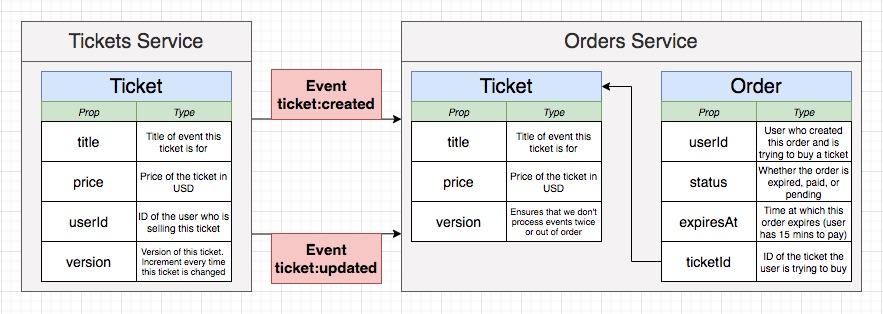
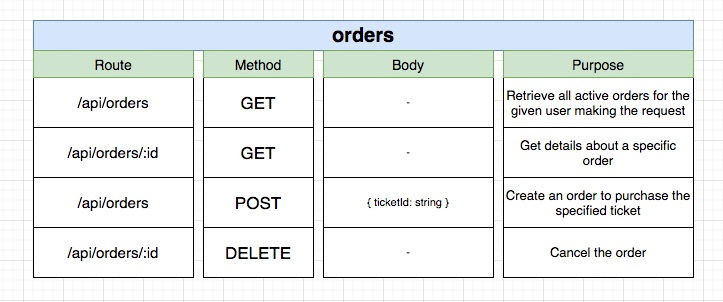

## **Section 17: Cross-Service Data Replication In Action**

## Table of Contents
- [**Section 17: Cross-Service Data Replication In Action**](#section-17-cross-service-data-replication-in-action)
- [Table of Contents](#table-of-contents)
  - [The Orders Service](#the-orders-service)
  - [Scaffolding the Orders Service](#scaffolding-the-orders-service)
  - [A Touch More Setup](#a-touch-more-setup)
  - [Ingress Routing Rules](#ingress-routing-rules)
  - [Scaffolding a Few Route Handlers](#scaffolding-a-few-route-handlers)
  - [Subtle Service Coupling](#subtle-service-coupling)
  - [Associating Orders and Tickets](#associating-orders-and-tickets)
  - [Order Model Setup](#order-model-setup)
  - [The Need for an Enum](#the-need-for-an-enum)
  - [Creating an Order Status Enum](#creating-an-order-status-enum)
  - [More on Mongoose Refs](#more-on-mongoose-refs)
  - [Defining the Ticket Model](#defining-the-ticket-model)
  - [Order Creation Logic](#order-creation-logic)
  - [Finding Reserved Tickets](#finding-reserved-tickets)
  - [Convenience Document Methods](#convenience-document-methods)
  - [Order Expiration Times](#order-expiration-times)
  - [Test Suite Setup](#test-suite-setup)
  - [Asserting Tickets Exist](#asserting-tickets-exist)
  - [Asserting Reserved Tickets](#asserting-reserved-tickets)
  - [Testing the Success Case](#testing-the-success-case)
  - [Fetching a User's Orders](#fetching-a-users-orders)
  - [A Slightly Complicated Test](#a-slightly-complicated-test)
  - [Fetching Individual Orders](#fetching-individual-orders)
  - [Does Fetching Work?](#does-fetching-work)
  - [Cancelling an Order](#cancelling-an-order)
  - [Can We Cancel?](#can-we-cancel)

### The Orders Service

| Services   | Summary                                                                                        |
| ---------- | ---------------------------------------------------------------------------------------------- |
| auth       | Everything related to user signup/signin/signout                                               |
| tickets    | Ticket creation/editing.  Knows whether a ticket can be updated                                |
| orders     | Order creation/editing                                                                         |
| expiration | Watches for orders to be created, cancels them after 15 minutes                                |
| payments   | Handles credit card payments.  Cancels orders if payments fails, completes if payment succeeds |





**[⬆ back to top](#table-of-contents)**

### Scaffolding the Orders Service

Orders Service Setup

- Duplicate the 'tickets' service
- Install dependencies
- Build an image out of the orders service
- Create a Kubernetes deployment file
- Set up file sync options in the skaffold.yaml file
- Set up routing rules in the ingress service

**[⬆ back to top](#table-of-contents)**

### A Touch More Setup

```yaml
apiVersion: apps/v1
kind: Deployment
metadata:
  name: orders-depl
spec:
  replicas: 1
  selector:
    matchLabels:
      app: orders
  template:
    metadata:
      labels:
        app: orders
    spec:
      containers:
        - name: orders
          image: chesterheng/orders
          env:
            - name: NATS_CLUSTER_ID
              value: 'ticketing'
            - name: NATS_CLIENT_ID
              valueFrom:
                fieldRef:
                  fieldPath: metadata.name
            - name: NATS_URL
              value: 'http://nats-srv:4222'
            - name: MONGO_URI
              value: 'mongodb://orders-mongo-srv:27017/orders'
            - name: JWT_KEY
              valueFrom:
                secretKeyRef:
                  name: jwt-secret
                  key: JWT_KEY
---
apiVersion: v1
kind: Service
metadata:
  name: orders-srv
spec:
  selector:
    app: orders
  ports:
    - name: orders
      protocol: TCP
      port: 3000
      targetPort: 3000
```

```yaml
apiVersion: apps/v1
kind: Deployment
metadata:
  name: orders-mongo-depl
spec:
  replicas: 1
  selector:
    matchLabels:
      app: orders-mongo
  template:
    metadata:
      labels:
        app: orders-mongo
    spec:
      containers:
        - name: orders-mongo
          image: mongo
---
apiVersion: v1
kind: Service
metadata:
  name: orders-mongo-srv
spec:
  selector:
    app: orders-mongo
  ports:
    - name: db
      protocol: TCP
      port: 27017
      targetPort: 27017
```

```yaml
  - image: chesterheng/orders
    context: orders
    docker:
      dockerfile: Dockerfile
    sync:
      manual:
        - src: 'src/**/*.ts'
          dest: .
```

**[⬆ back to top](#table-of-contents)**

### Ingress Routing Rules

```yaml
  - path: /api/orders/?(.*)
    backend:
      serviceName: orders-srv
      servicePort: 3000
```

**[⬆ back to top](#table-of-contents)**

### Scaffolding a Few Route Handlers



```typescript
import express, { Request, Response } from 'express';

const router = express.Router();

router.get('/api/orders', async (req: Request, res: Response) => {
  res.send({});
});

export { router as indexOrderRouter };
```

**[⬆ back to top](#table-of-contents)**

### Subtle Service Coupling

```typescript
router.post(
  '/api/orders', 
  requireAuth, 
  [
    body('ticketId')
      .not()
      .isEmpty()
      .custom((input: string) => mongoose.Types.ObjectId.isValid(input))
      .withMessage('TicketId must be provided')
  ], 
  validateRequest, 
  async (req: Request, res: Response) => {
    res.send({});
  }
);
```

**[⬆ back to top](#table-of-contents)**

### Associating Orders and Tickets
**[⬆ back to top](#table-of-contents)**

### Order Model Setup
**[⬆ back to top](#table-of-contents)**

### The Need for an Enum
**[⬆ back to top](#table-of-contents)**

### Creating an Order Status Enum
**[⬆ back to top](#table-of-contents)**

### More on Mongoose Refs
**[⬆ back to top](#table-of-contents)**

### Defining the Ticket Model
**[⬆ back to top](#table-of-contents)**

### Order Creation Logic
**[⬆ back to top](#table-of-contents)**

### Finding Reserved Tickets
**[⬆ back to top](#table-of-contents)**

### Convenience Document Methods
**[⬆ back to top](#table-of-contents)**

### Order Expiration Times
**[⬆ back to top](#table-of-contents)**

### Test Suite Setup
**[⬆ back to top](#table-of-contents)**

### Asserting Tickets Exist
**[⬆ back to top](#table-of-contents)**

### Asserting Reserved Tickets
**[⬆ back to top](#table-of-contents)**

### Testing the Success Case
**[⬆ back to top](#table-of-contents)**

### Fetching a User's Orders
**[⬆ back to top](#table-of-contents)**

### A Slightly Complicated Test
**[⬆ back to top](#table-of-contents)**

### Fetching Individual Orders
**[⬆ back to top](#table-of-contents)**

### Does Fetching Work?
**[⬆ back to top](#table-of-contents)**

### Cancelling an Order
**[⬆ back to top](#table-of-contents)**

### Can We Cancel?
**[⬆ back to top](#table-of-contents)**
