## **Section 19: Listening for Events and Handling Concurrency Issues**

## Table of Contents
- [**Section 19: Listening for Events and Handling Concurrency Issues**](#section-19-listening-for-events-and-handling-concurrency-issues)
- [Table of Contents](#table-of-contents)
  - [Time for Listeners!](#time-for-listeners)
  - [Reminder on Listeners](#reminder-on-listeners)
  - [Blueprint for Listeners](#blueprint-for-listeners)
  - [A Few More Reminders](#a-few-more-reminders)
  - [Simple onMessage Implementation](#simple-onmessage-implementation)
  - [ID Adjustment](#id-adjustment)
  - [Ticket Updated Listener Implementation](#ticket-updated-listener-implementation)
  - [Initializing the Listeners](#initializing-the-listeners)
  - [A Quick Manual Test](#a-quick-manual-test)
  - [Clear Concurrency Issues](#clear-concurrency-issues)
  - [Reminder on Versioning Records](#reminder-on-versioning-records)
  - [Optimistic Concurrency Control](#optimistic-concurrency-control)
  - [Mongoose Update-If-Current](#mongoose-update-if-current)
  - [Implementing OCC with Mongoose](#implementing-occ-with-mongoose)
  - [Testing OCC](#testing-occ)
  - [One More Test](#one-more-test)
  - [Who Updates Versions?](#who-updates-versions)
  - [Including Versions in Events](#including-versions-in-events)
  - [Updating Tickets Event Definitions](#updating-tickets-event-definitions)
  - [Applying a Version Query](#applying-a-version-query)
  - [Did it Work?](#did-it-work)
  - [Abstracted Query Method](#abstracted-query-method)
  - [[Optional] Versioning Without Update-If-Current](#optional-versioning-without-update-if-current)
  - [Testing Listeners](#testing-listeners)
  - [A Complete Listener Test](#a-complete-listener-test)
  - [Testing the Ack Call](#testing-the-ack-call)
  - [Testing the Ticket Updated Listener](#testing-the-ticket-updated-listener)
  - [Success Case Testing](#success-case-testing)
  - [Out-Of-Order Events](#out-of-order-events)
  - [The Next Few Video](#the-next-few-video)
  - [Fixing a Few Tests](#fixing-a-few-tests)
  - [Listeners in the Tickets Service](#listeners-in-the-tickets-service)
  - [Building the Listener](#building-the-listener)
  - [Strategies for Locking a Ticket](#strategies-for-locking-a-ticket)
  - [Reserving a Ticket](#reserving-a-ticket)
  - [Setup for Testing Reservation](#setup-for-testing-reservation)
  - [Test Implementation](#test-implementation)
  - [Missing Update Event](#missing-update-event)
  - [Private vs Protected Properties](#private-vs-protected-properties)
  - [Publishing While Listening](#publishing-while-listening)
  - [Mock Function Arguments](#mock-function-arguments)
  - [Order Cancelled Listener](#order-cancelled-listener)
  - [A Lightning-Quick Test](#a-lightning-quick-test)
  - [Don't Forget to Listen!](#dont-forget-to-listen)
  - [Rejecting Edits of Reserved Tickets](#rejecting-edits-of-reserved-tickets)

### Time for Listeners!

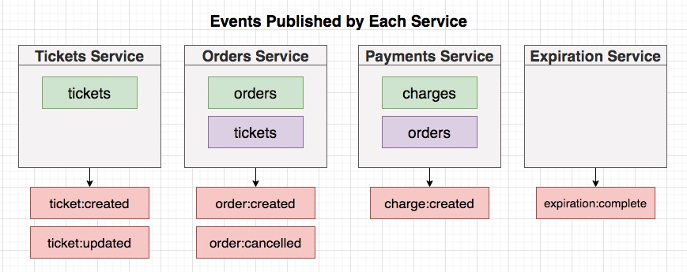

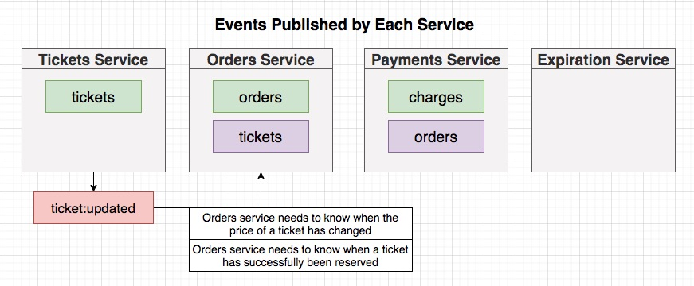


**[⬆ back to top](#table-of-contents)**

### Reminder on Listeners

- Extends from Listener class
  - Define subject and queueGroupName variables 
  - Define onMessage function
- Implement Event interface

**[⬆ back to top](#table-of-contents)**

### Blueprint for Listeners

```typescript
import { Message } from 'node-nats-streaming';
import { Subjects, Listener, TicketCreatedEvent } from '@chticketing/common';
import { Ticket } from '../../models/ticket';

export class TicketCreatedListener extends Listener<TicketCreatedEvent> {
  subject: Subjects.TicketCreated = Subjects.TicketCreated;
  queueGroupName = 'orders-service';

  onMessage(data: TicketCreatedEvent['data'], msg: Message) {}
}
```

**[⬆ back to top](#table-of-contents)**

### A Few More Reminders

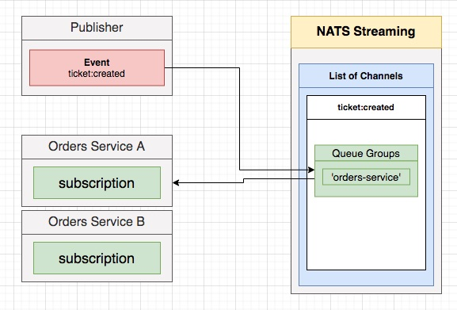

- Publisher send a ticket:created Event is send to one of any members in orders-service Queue Group

```typescript
export const queueGroupName = 'orders-service';
```

**[⬆ back to top](#table-of-contents)**

### Simple onMessage Implementation


```typescript
  async onMessage(data: TicketCreatedEvent['data'], msg: Message) {
    const { title, price } = data;

    const ticket = Ticket.build({
      title, price
    });
    await ticket.save();

    msg.ack;
  }
```

**[⬆ back to top](#table-of-contents)**

### ID Adjustment


- Need to adjust Id so both tickets data in Tickets and Orders Service have same Id


```typescript
ticketSchema.statics.build = (attrs: TicketAttrs) => {
  return new Ticket({
    _id: attrs.id,
    title: attrs.title,
    price: attrs.price
  });
};
```

```typescript
async onMessage(data: TicketCreatedEvent['data'], msg: Message) {
  const { id, title, price } = data;

  const ticket = Ticket.build({
    id,
    title,
    price,
  });
  await ticket.save();

  msg.ack();
}
```

**[⬆ back to top](#table-of-contents)**

### Ticket Updated Listener Implementation

```typescript
import { Message } from 'node-nats-streaming';
import { Subjects, Listener, TicketUpdatedEvent } from '@chticketing/common';
import { Ticket } from '../../models/ticket';
import { queueGroupName } from './queue-group-name';

export class TicketUpdatedListener extends Listener<TicketUpdatedEvent> {
  subject: Subjects.TicketUpdated = Subjects.TicketUpdated;
  queueGroupName = queueGroupName;

  async onMessage(data: TicketUpdatedEvent['data'], msg: Message) {
    const ticket = await Ticket.findById(data.id);

    if (!ticket) {
      throw new Error('Ticket not found');
    }

    const { title, price } = data;
    ticket.set({ title, price });
    await ticket.save();

    msg.ack();
  }
}
```

**[⬆ back to top](#table-of-contents)**

### Initializing the Listeners

```typescript
  new TicketCreatedListener(natsWrapper.client).listen();
  new TicketUpdatedListener(natsWrapper.client).listen();
```

**[⬆ back to top](#table-of-contents)**

### A Quick Manual Test

- Sign up
- Create Ticket
- Update Ticker

**[⬆ back to top](#table-of-contents)**

### Clear Concurrency Issues


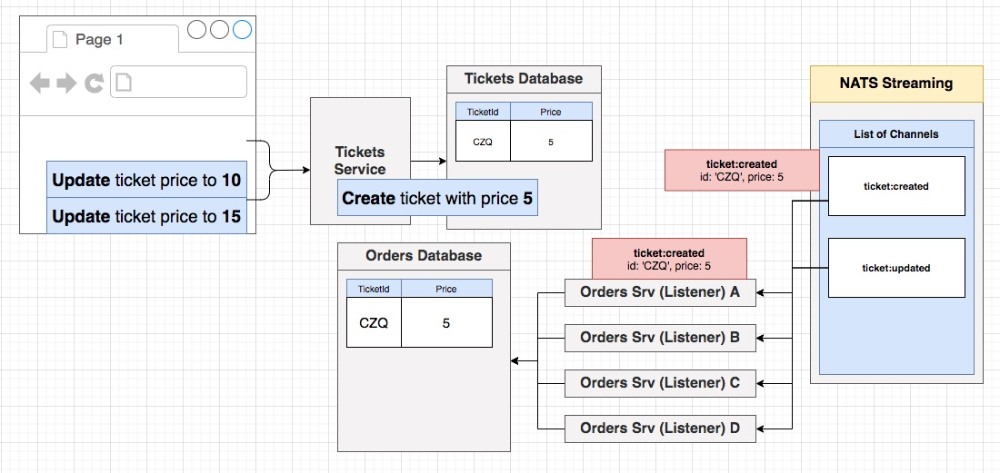
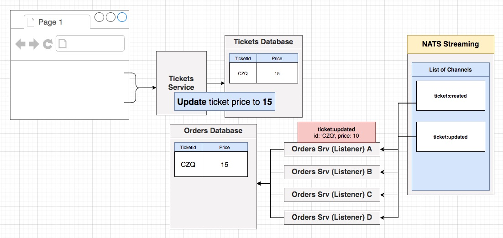

- Process ticket:updated price: 15 first
- Then, process ticket:updated price: 10

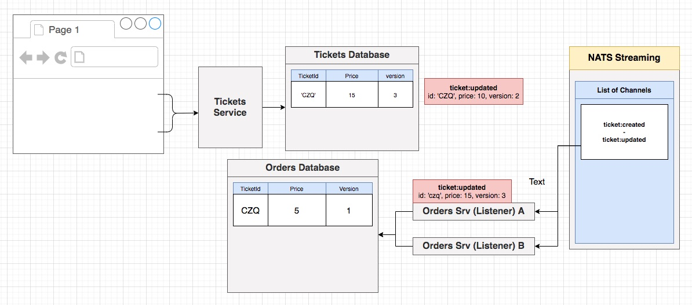

- Create 4 orders service instances

```yaml
  replicas: 4
```

```console
<!-- #1 method -->
kubectl get pods
kubectl port-forward tickets-mongo-depl-685f7f898-tp27w 27017:27017
mongo mongodb://localhost:27017/tickets
> db.tickets.find({})

<!-- or -->

kubectl port-forward orders-mongo-depl-5b54d94b4d-vwnqw 27017:27017
mongo mongodb://localhost:27017/orders
> db.tickets.find({})
```

```console
<!-- #2 method -->
kubectl get pods
kubectl exec -it tickets-mongo-depl-664cc88d8f-ss9mv mongo mongodb://localhost:27017/tickets
> db.tickets.find({})
> db.tickets.find({ price: 10 }).length()
> db.tickets.remove({})

kubectl exec -it orders-mongo-depl-59db4f4877-4k9bq mongo mongodb://localhost:27017/orders
> db.tickets.find({})
> db.tickets.find({ price: 10 }).length()
> db.tickets.remove({})
```

**[⬆ back to top](#table-of-contents)**

### Reminder on Versioning Records

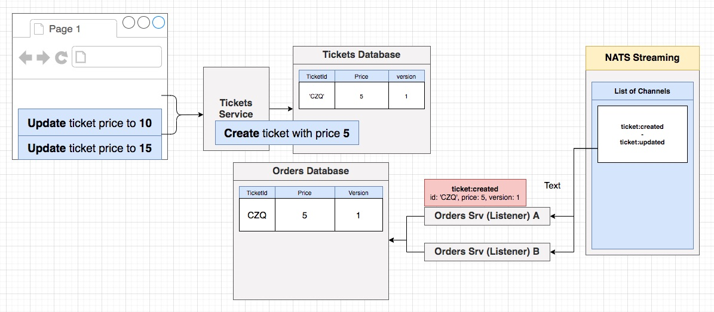
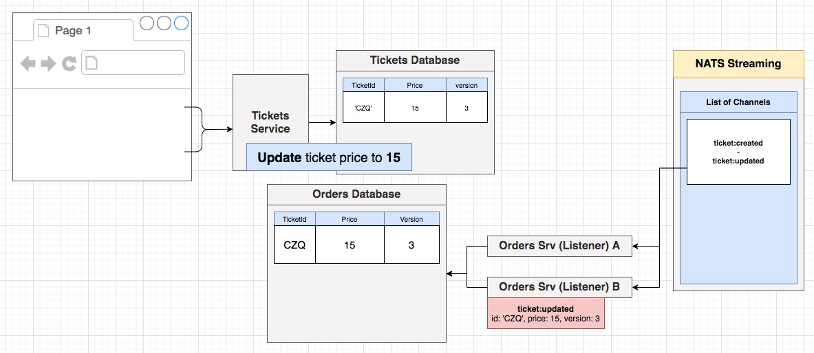

**[⬆ back to top](#table-of-contents)**

### Optimistic Concurrency Control

[Optimistic Concurrency Control](https://www.youtube.com/watch?v=_NThms8k5k4)

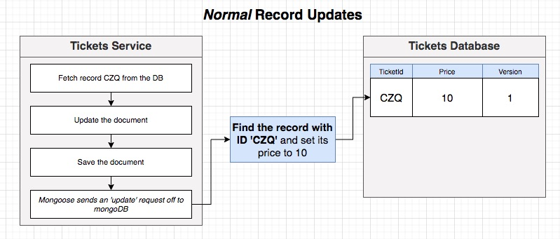
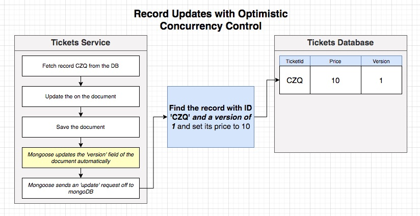
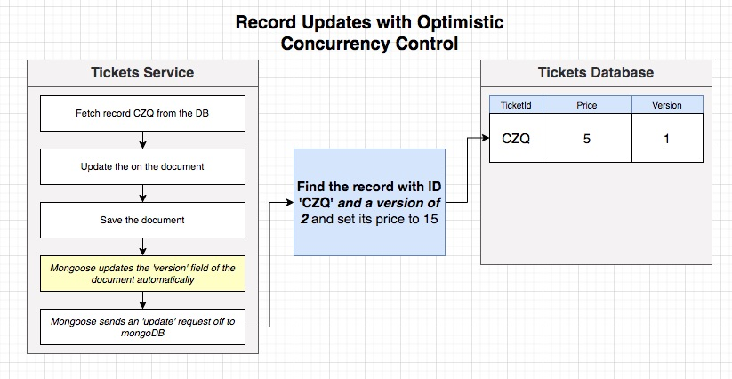

**[⬆ back to top](#table-of-contents)**

### Mongoose Update-If-Current

- [mongoose-update-if-current](https://github.com/eoin-obrien/mongoose-update-if-current)

**[⬆ back to top](#table-of-contents)**

### Implementing OCC with Mongoose

```typescript
ticketSchema.set('versionKey', 'version');
ticketSchema.plugin(updateIfCurrentPlugin);
```

**[⬆ back to top](#table-of-contents)**

### Testing OCC

```typescript
import { Ticket } from '../ticket';

it('implements optimistic concurrency control', async (done) => {
  // Create an instance of a ticket
  const ticket = Ticket.build({
    title: 'concert',
    price: 5,
    userId: '123',
  });

  // Save the ticket to the database
  await ticket.save();

  // fetch the ticket twice
  const firstInstance = await Ticket.findById(ticket.id);
  const secondInstance = await Ticket.findById(ticket.id);

  // make two separate changes to the tickets we fetched
  firstInstance!.set({ price: 10 });
  secondInstance!.set({ price: 15 });

  // save the first fetched ticket
  await firstInstance!.save();

  // save the second fetched ticket and expect an error
  try {
    await secondInstance!.save();
  } catch (err) {
    return done();
  }

  throw new Error('Should not reach this point');
});
```

**[⬆ back to top](#table-of-contents)**

### One More Test

```typescript
it('increments the version number on multiple saves', async () => {
  const ticket = Ticket.build({
    title: 'concert',
    price: 20,
    userId: '123',
  });

  await ticket.save();
  expect(ticket.version).toEqual(0);
  await ticket.save();
  expect(ticket.version).toEqual(1);
  await ticket.save();
  expect(ticket.version).toEqual(2);
});
```

**[⬆ back to top](#table-of-contents)**

### Who Updates Versions?

- When should we increment or include the 'version' number of a record with an event?

> Increment the 'version' number whenever the primary service responsible for a record emits an event to describe a create/update/destroy to a record

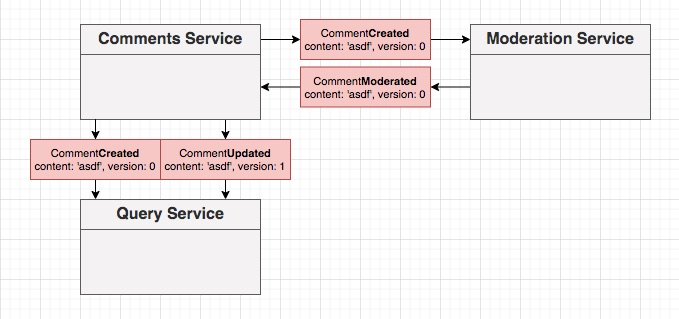

**[⬆ back to top](#table-of-contents)**

### Including Versions in Events

```typescript
version: number;
```

**[⬆ back to top](#table-of-contents)**

### Updating Tickets Event Definitions

```typescript
  await new TicketCreatedPublisher(natsWrapper.client).publish({
    id: ticket.id,
    title: ticket.title,
    price: ticket.price,
    userId: ticket.userId,
    version: ticket.version
  });
```

```typescript
  await new TicketUpdatedPublisher(natsWrapper.client).publish({
    id: ticket.id,
    title: ticket.title,
    price: ticket.price,
    userId: ticket.userId,
    version: ticket.version
  });
```

**[⬆ back to top](#table-of-contents)**

### Applying a Version Query

- [mongoose-update-if-current](https://github.com/eoin-obrien/mongoose-update-if-current)

```typescript
// tickets.ts
  ticketSchema.set('versionKey', 'version');
  ticketSchema.plugin(updateIfCurrentPlugin);
```

```typescript
// ticket-uodated-listener.ts
  const ticket = await Ticket.findOne({
    _id: data.id,
    version: data.version - 1
  });
```

**[⬆ back to top](#table-of-contents)**

### Did it Work?

```console
cd section-19/ticketing
skaffold dev
cd ../t
node index.js
```

```console
kubectl get pods
kubectl exec -it tickets-mongo-depl-664cc88d8f-ss9mv mongo mongodb://localhost:27017/tickets
> db
> db.tickets.find({ price: 15 }).length()

kubectl exec -it orders-mongo-depl-59db4f4877-4k9bq mongo mongodb://localhost:27017/orders
> db
> db.tickets.find({ price: 15 }).length()
```

**[⬆ back to top](#table-of-contents)**

### Abstracted Query Method

```typescript
ticketSchema.statics.findByEvent = (event: { id: string; version: number }) => {
  return Ticket.findOne({
    _id: event.id,
    version: event.version - 1,
  });
};
```

**[⬆ back to top](#table-of-contents)**

### [Optional] Versioning Without Update-If-Current


mongoose-update-if-current

- Updates the version number on records before they are saved
```typescript
// ticket-updated-listener.ts
  const { title, price, version } = data;
  ticket.set({ title, price, version });
  await ticket.save();
```
- Customizes the find-and-update operation (save) to look for the correct version
```typescript
// ticket.ts
ticketSchema.pre('save', function(done) {
  // @ts-ignore
  this.$where = {
    version: this.get('version') - 1
  };

  done();
})
```

```
kubectl get pods
kubectl exec -it orders-mongo-depl-857959646-s576x mongo
> show dbs
> use orders
> db.tickets
> db.tickets.find({ price: 200.34 })
```

**[⬆ back to top](#table-of-contents)**

### Testing Listeners

```typescript
const setup = async () => {
  // create an instance of the listener
  // create a fake data event
  // create a fake message object
};

it('creates and saves a ticket', async () => {
  // call the onMessage function with the data object + message object
  // write assertions to make sure a ticket was created!
});

it('acks the message', async () => {
  // call the onMessage function with the data object + message object
  // write assertions to make sure ack function is called
});
```

**[⬆ back to top](#table-of-contents)**

### A Complete Listener Test

```typescript
const setup = async () => {
  // create an instance of the listener
  const listener = new TicketCreatedListener(natsWrapper.client);

  // create a fake data event
  const data: TicketCreatedEvent['data'] = {
    version: 0,
    id: new mongoose.Types.ObjectId().toHexString(),
    title: 'concert',
    price: 10,
    userId: new mongoose.Types.ObjectId().toHexString(),
  };

  // create a fake message object
  // @ts-ignore
  const msg: Message = {
    ack: jest.fn(),
  };

  return { listener, data, msg };
};

it('creates and saves a ticket', async () => {
  const { listener, data, msg } = await setup();

  // call the onMessage function with the data object + message object
  await listener.onMessage(data, msg);

  // write assertions to make sure a ticket was created!
  const ticket = await Ticket.findById(data.id);

  expect(ticket).toBeDefined();
  expect(ticket!.title).toEqual(data.title);
  expect(ticket!.price).toEqual(data.price);
});
```

**[⬆ back to top](#table-of-contents)**

### Testing the Ack Call

```typescript
it('acks the message', async () => {
  const { data, listener, msg } = await setup();

  // call the onMessage function with the data object + message object
  await listener.onMessage(data, msg);

  // write assertions to make sure ack function is called
  expect(msg.ack).toHaveBeenCalled();
});
```

**[⬆ back to top](#table-of-contents)**

### Testing the Ticket Updated Listener

```typescript
const setup = async () => {
  // Create a listener
  const listener = new TicketUpdatedListener(natsWrapper.client);

  // Create and save a ticket
  const ticket = Ticket.build({
    id: mongoose.Types.ObjectId().toHexString(),
    title: 'concert',
    price: 20,
  });
  await ticket.save();

  // Create a fake data object
  const data: TicketUpdatedEvent['data'] = {
    id: ticket.id,
    version: ticket.version + 1,
    title: 'new concert',
    price: 999,
    userId: 'ablskdjf',
  };

  // Create a fake msg object
  // @ts-ignore
  const msg: Message = {
    ack: jest.fn(),
  };

  // return all of this stuff
  return { msg, data, ticket, listener };
};
```

**[⬆ back to top](#table-of-contents)**

### Success Case Testing

```typescript
it('finds, updates, and saves a ticket', async () => {
  const { msg, data, ticket, listener } = await setup();

  await listener.onMessage(data, msg);

  const updatedTicket = await Ticket.findById(ticket.id);

  expect(updatedTicket!.title).toEqual(data.title);
  expect(updatedTicket!.price).toEqual(data.price);
  expect(updatedTicket!.version).toEqual(data.version);
});

it('acks the message', async () => {
  const { msg, data, listener } = await setup();

  await listener.onMessage(data, msg);

  expect(msg.ack).toHaveBeenCalled();
});
```

**[⬆ back to top](#table-of-contents)**

### Out-Of-Order Events

```typescript
it('does not call ack if the event has a skipped version number', async () => {
  const { msg, data, listener, ticket } = await setup();

  data.version = 10;

  try {
    await listener.onMessage(data, msg);
  } catch (err) {}

  expect(msg.ack).not.toHaveBeenCalled();
});
```

**[⬆ back to top](#table-of-contents)**

### The Next Few Video

- Add the 'mongoose-update-if-current' module into the Orders mo
```typescript
interface OrderDoc extends mongoose.Document {
  userId: string;
  status: OrderStatus;
  expiresAt: Date;
  ticket: TicketDoc;
  version: number;
}

orderSchema.set('versionKey', 'version');
orderSchema.plugin(updateIfCurrentPlugin);
```
- Fix up some tests - we are creating some Tickets in the Orders service without providing them an ID
- Fix up some route handlers - we are publishing events around orders but not providing the version of the order

**[⬆ back to top](#table-of-contents)**

### Fixing a Few Tests

- Fix up some tests - we are creating some Tickets in the Orders service without providing them an ID
```typescript
  const ticket = Ticket.build({
    id: mongoose.Types.ObjectId().toHexString(),
    title: 'concert',
    price: 20,
  });
```
- Fix up some route handlers - we are publishing events around orders but not providing the version of the order
```typescript
  new OrderCancelledPublisher(natsWrapper.client).publish({
    id: order.id,
    version: order.version,
    ticket: {
      id: order.ticket.id,
    },
  });
```

**[⬆ back to top](#table-of-contents)**

### Listeners in the Tickets Service


**[⬆ back to top](#table-of-contents)**

### Building the Listener

```typescript
import { Message } from 'node-nats-streaming';
import { Listener, OrderCreatedEvent, Subjects } from '@chticketing/common';
import { queueGroupName } from './queue-group-name';

export class OrderCreatedListener extends Listener<OrderCreatedEvent> {
  subject: Subjects.OrderCreated = Subjects.OrderCreated;
  queueGroupName = queueGroupName;

  async onMessage(data: OrderCreatedEvent['data'], msg: Message) {}
}
```

**[⬆ back to top](#table-of-contents)**

### Strategies for Locking a Ticket

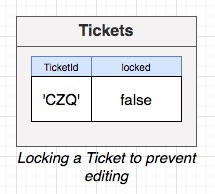
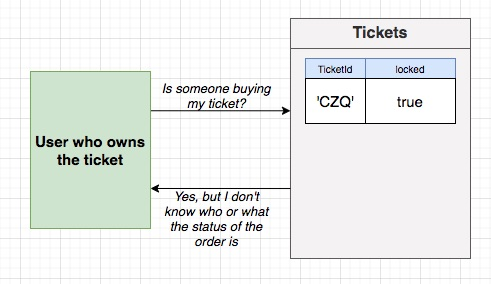
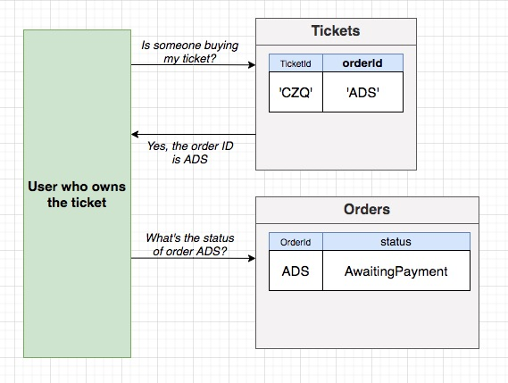

**[⬆ back to top](#table-of-contents)**

### Reserving a Ticket

```typescript
interface TicketDoc extends mongoose.Document {
  title: string;
  price: number;
  userId: string;
  version: number;
  orderId?: string;
}
```

```typescript
  async onMessage(data: OrderCreatedEvent['data'], msg: Message) {
    // Find the ticket that the order is reserving
    const ticket = await Ticket.findById(data.ticket.id);

    // If no ticket, throw error
    if (!ticket) {
      throw new Error('Ticket not found');
    }

    // Mark the ticket as being reserved by setting its orderId property
    ticket.set({ orderId: data.id });

    // Save the ticket
    await ticket.save();

    // ack the message
    msg.ack();
  }
```

**[⬆ back to top](#table-of-contents)**

### Setup for Testing Reservation

```typescript
const setup = async () => {
  // Create an instance of the listener
  const listener = new OrderCreatedListener(natsWrapper.client);

  // Create and save a ticket
  const ticket = Ticket.build({
    title: 'concert',
    price: 99,
    userId: 'asdf',
  });
  await ticket.save();

  // Create the fake data event
  const data: OrderCreatedEvent['data'] = {
    id: mongoose.Types.ObjectId().toHexString(),
    version: 0,
    status: OrderStatus.Created,
    userId: 'alskdfj',
    expiresAt: 'alskdjf',
    ticket: {
      id: ticket.id,
      price: ticket.price,
    },
  };

  // @ts-ignore
  const msg: Message = {
    ack: jest.fn(),
  };

  return { listener, ticket, data, msg };
};
```

**[⬆ back to top](#table-of-contents)**

### Test Implementation

```typescript
it('sets the userId of the ticket', async () => {
  const { listener, ticket, data, msg } = await setup();

  await listener.onMessage(data, msg);

  const updatedTicket = await Ticket.findById(ticket.id);

  expect(updatedTicket!.orderId).toEqual(data.id);
});

it('acks the message', async () => {
  const { listener, ticket, data, msg } = await setup();
  await listener.onMessage(data, msg);

  expect(msg.ack).toHaveBeenCalled();
});
```

**[⬆ back to top](#table-of-contents)**

### Missing Update Event

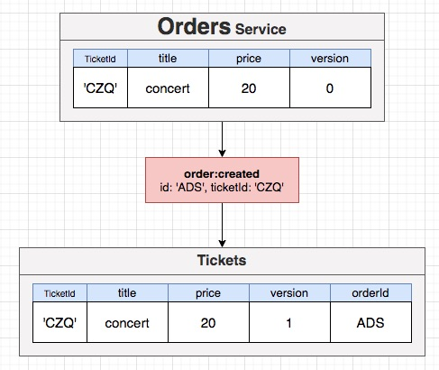
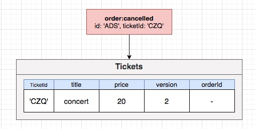
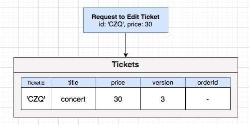
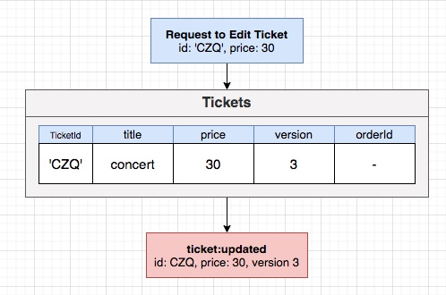
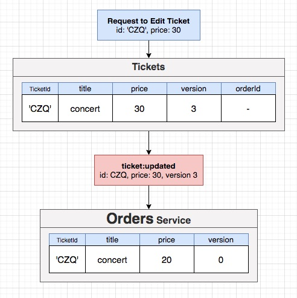

**[⬆ back to top](#table-of-contents)**

### Private vs Protected Properties

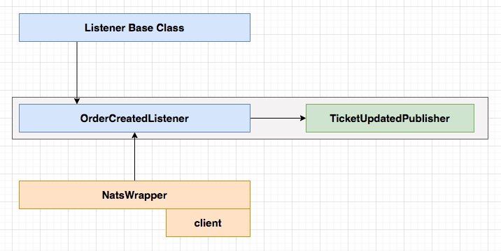


**[⬆ back to top](#table-of-contents)**

### Publishing While Listening

```typescript
// base-listener.ts
export abstract class Listener<T extends Event> {
  abstract subject: T['subject'];
  abstract queueGroupName: string;
  abstract onMessage(data: T['data'], msg: Message): void;
  protected client: Stan;
  protected ackWait = 5 * 1000;

}
```

```typescript
// ticket-updated-event.ts
export interface TicketUpdatedEvent {
  subject: Subjects.TicketUpdated;
  data: {
    id: string;
    version: number;
    title: string;
    price: number;
    userId: string;
    orderId?: string;
  };
}
```

```typescript
// order-created-listener.ts
  await new TicketUpdatedPublisher(this.client).publish({
    id: ticket.id,
    price: ticket.price,
    title: ticket.title,
    userId: ticket.userId,
    orderId: ticket.orderId,
    version: ticket.version,
  });
```

**[⬆ back to top](#table-of-contents)**

### Mock Function Arguments

```typescript
it('publishes a ticket updated event', async () => {
  const { listener, ticket, data, msg } = await setup();

  await listener.onMessage(data, msg);

  expect(natsWrapper.client.publish).toHaveBeenCalled();

  const ticketUpdatedData = JSON.parse(
    (natsWrapper.client.publish as jest.Mock).mock.calls[0][1]
  );

  expect(data.id).toEqual(ticketUpdatedData.orderId);
});
```

**[⬆ back to top](#table-of-contents)**

### Order Cancelled Listener

```typescript
import { Listener, OrderCancelledEvent, Subjects } from '@chticketing/common';
import { Message } from 'node-nats-streaming';
import { queueGroupName } from './queue-group-name';
import { Ticket } from '../../models/ticket';
import { TicketUpdatedPublisher } from '../publishers/ticket-updated-publisher';

export class OrderCancelledListener extends Listener<OrderCancelledEvent> {
  subject: Subjects.OrderCancelled = Subjects.OrderCancelled;
  queueGroupName = queueGroupName;

  async onMessage(data: OrderCancelledEvent['data'], msg: Message) {
    const ticket = await Ticket.findById(data.ticket.id);

    if (!ticket) {
      throw new Error('Ticket not found');
    }

    ticket.set({ orderId: undefined });
    await ticket.save();
    await new TicketUpdatedPublisher(this.client).publish({
      id: ticket.id,
      orderId: ticket.orderId,
      userId: ticket.userId,
      price: ticket.price,
      title: ticket.title,
      version: ticket.version,
    });

    msg.ack();
  }
}
```

**[⬆ back to top](#table-of-contents)**

### A Lightning-Quick Test

```typescript
it('updates the ticket, publishes an event, and acks the message', async () => {
  const { msg, data, ticket, orderId, listener } = await setup();

  await listener.onMessage(data, msg);

  const updatedTicket = await Ticket.findById(ticket.id);
  expect(updatedTicket!.orderId).not.toBeDefined();
  expect(msg.ack).toHaveBeenCalled();
  expect(natsWrapper.client.publish).toHaveBeenCalled();
});
```
**[⬆ back to top](#table-of-contents)**

### Don't Forget to Listen!

```typescript
  new OrderCreatedListener(natsWrapper.client).listen();
  new OrderCancelledListener(natsWrapper.client).listen();
```

**[⬆ back to top](#table-of-contents)**

### Rejecting Edits of Reserved Tickets
**[⬆ back to top](#table-of-contents)**
