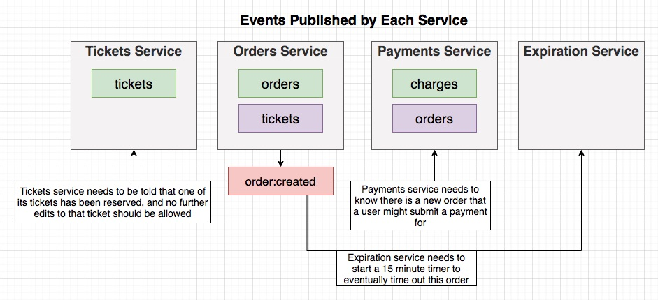
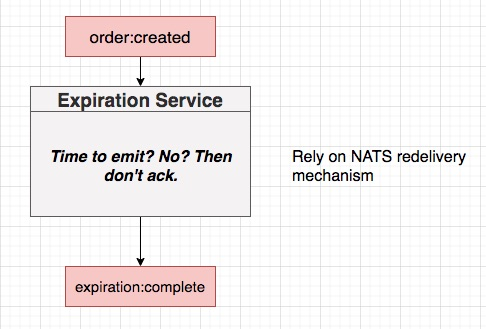
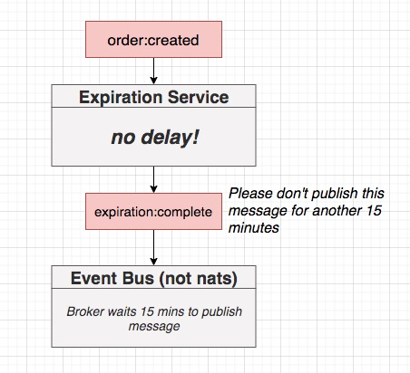
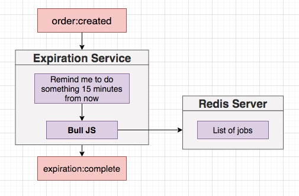
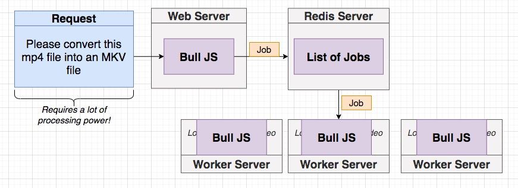
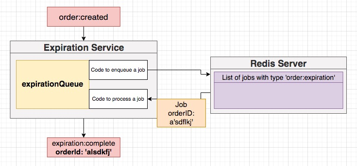

## **Section 20: Worker Services**

## Table of Contents
- [**Section 20: Worker Services**](#section-20-worker-services)
- [Table of Contents](#table-of-contents)
  - [The Expiration Service](#the-expiration-service)
  - [Expiration Options](#expiration-options)
  - [Initial Setup](#initial-setup)
  - [A Touch of Kubernetes Setup](#a-touch-of-kubernetes-setup)
  - [File Sync Setup](#file-sync-setup)
  - [Listener Creation](#listener-creation)
  - [What's Bull All About?](#whats-bull-all-about)
  - [Creating a Queue](#creating-a-queue)
  - [Queueing a Job on Event Arrival](#queueing-a-job-on-event-arrival)
  - [Testing Job Processing](#testing-job-processing)
  - [Delaying Job Processing](#delaying-job-processing)
  - [Defining the Expiration Complete Event](#defining-the-expiration-complete-event)
  - [Publishing an Event on Job Processing](#publishing-an-event-on-job-processing)
  - [Handling an Expiration Event](#handling-an-expiration-event)
  - [Emitting the Order Cancelled Event](#emitting-the-order-cancelled-event)
  - [Testing the Expiration Complete Listener](#testing-the-expiration-complete-listener)
  - [A Touch More Testing](#a-touch-more-testing)
  - [Listening for Expiration](#listening-for-expiration)
  - [Don't Cancel Completed Orders!](#dont-cancel-completed-orders)

### The Expiration Service




**[⬆ back to top](#table-of-contents)**

### Expiration Options

- Option 1: Use timer
- Option 2: Rely on NATS redelivery mechanism 
- Option 3: Scheduled Event (Not supported by NATS)
- Option 4: Use Bull JS






**[⬆ back to top](#table-of-contents)**

### Initial Setup


**[⬆ back to top](#table-of-contents)**

### A Touch of Kubernetes Setup

```console
docker build -t chesterheng/expiration .
docker push chesterheng/expiration
```

```yaml
apiVersion: apps/v1
kind: Deployment
metadata:
  name: expiration-redis-depl
spec:
  replicas: 1
  selector:
    matchLabels:
      app: expiration-redis
  template:
    metadata:
      labels:
        app: expiration-redis
    spec:
      containers:
        - name: expiration-redis
          image: redis
---
apiVersion: v1
kind: Service
metadata:
  name: expiration-redis-srv
spec:
  selector:
    app: expiration-redis
  ports:
    - name: db
      protocol: TCP
      port: 6379
      targetPort: 6379
```

```yaml
apiVersion: apps/v1
kind: Deployment
metadata:
  name: expiration-depl
spec:
  replicas: 1
  selector:
    matchLabels:
      app: expiration
  template:
    metadata:
      labels:
        app: expiration
    spec:
      containers:
        - name: expiration
          image: chesterheng/expiration
          env:
            - name: NATS_CLIENT_ID
              valueFrom:
                fieldRef:
                  fieldPath: metadata.name
            - name: NATS_URL
              value: 'http://nats-srv:4222'
            - name: NATS_CLUSTER_ID
              value: ticketing
            - name: REDIS_HOST
              value: expiration-redis-srv
```

**[⬆ back to top](#table-of-contents)**

### File Sync Setup

```yaml
  - image: chesterheng/expiration
    context: expiration
    docker:
      dockerfile: Dockerfile
    sync:
      manual:
        - src: 'src/**/*.ts'
          dest: .
```

**[⬆ back to top](#table-of-contents)**

### Listener Creation

```typescript
export class OrderCreatedListener extends Listener<OrderCreatedEvent> {
  subject: Subjects.OrderCreated = Subjects.OrderCreated;
  queueGroupName = queueGroupName;

  async onMessage(data: OrderCreatedEvent['data'], msg: Message) {}
}
```

**[⬆ back to top](#table-of-contents)**

### What's Bull All About?





**[⬆ back to top](#table-of-contents)**

### Creating a Queue



**[⬆ back to top](#table-of-contents)**

### Queueing a Job on Event Arrival
**[⬆ back to top](#table-of-contents)**

### Testing Job Processing
**[⬆ back to top](#table-of-contents)**

### Delaying Job Processing
**[⬆ back to top](#table-of-contents)**

### Defining the Expiration Complete Event
**[⬆ back to top](#table-of-contents)**

### Publishing an Event on Job Processing
**[⬆ back to top](#table-of-contents)**

### Handling an Expiration Event
**[⬆ back to top](#table-of-contents)**

### Emitting the Order Cancelled Event
**[⬆ back to top](#table-of-contents)**

### Testing the Expiration Complete Listener
**[⬆ back to top](#table-of-contents)**

### A Touch More Testing
**[⬆ back to top](#table-of-contents)**

### Listening for Expiration
**[⬆ back to top](#table-of-contents)**

### Don't Cancel Completed Orders!
**[⬆ back to top](#table-of-contents)**