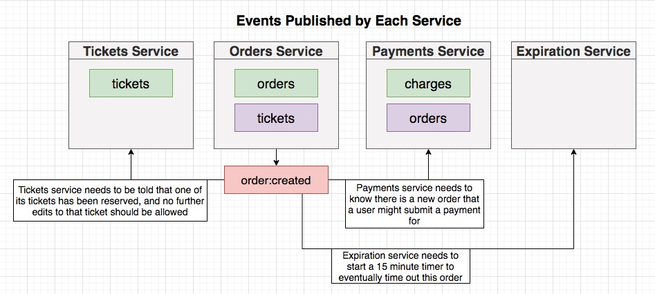
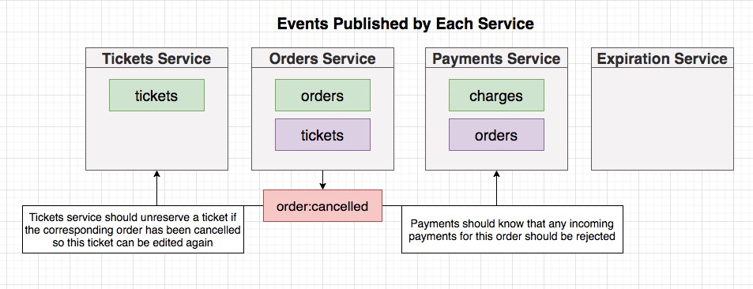
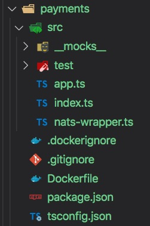
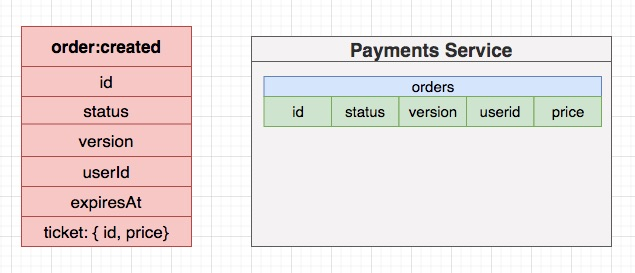
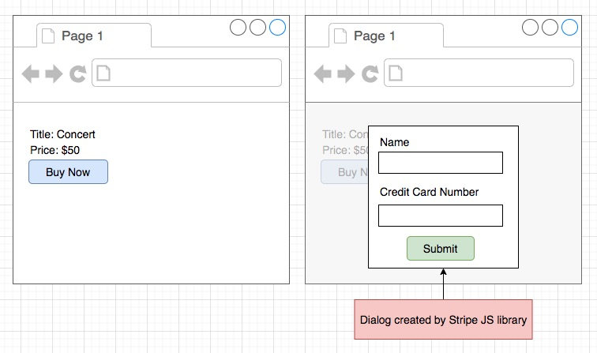
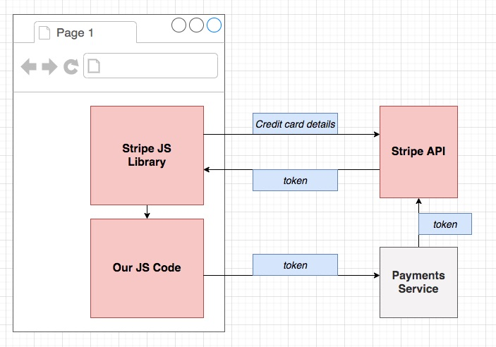
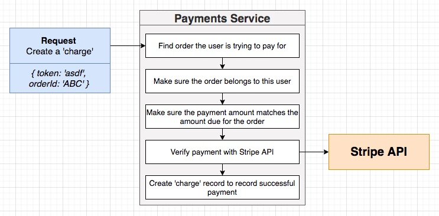
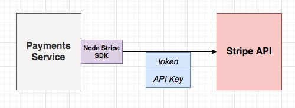

## **Section 21: Handling Payments**

## Table of Contents
- [**Section 21: Handling Payments**](#section-21-handling-payments)
- [Table of Contents](#table-of-contents)
  - [The Payments Service](#the-payments-service)
  - [Initial Setup](#initial-setup)
  - [Replicated Fields](#replicated-fields)
  - [Another Order Model!](#another-order-model)
  - [Update-If-Current](#update-if-current)
  - [Replicating Orders](#replicating-orders)
  - [Testing Order Creation](#testing-order-creation)
  - [Marking an Order as Cancelled](#marking-an-order-as-cancelled)
  - [Cancelled Testing](#cancelled-testing)
  - [Starting the Listeners](#starting-the-listeners)
  - [Payments Flow with Stripe](#payments-flow-with-stripe)
  - [Implementing the Create Charge Handler](#implementing-the-create-charge-handler)
  - [Validating Order Payment](#validating-order-payment)
  - [Testing Order Validation Before Payment](#testing-order-validation-before-payment)
  - [Testing Same-User Validation](#testing-same-user-validation)
  - [Stripe Setup](#stripe-setup)
  - [Creating a Stripe Secret](#creating-a-stripe-secret)
  - [Creating a Charge with Stripe](#creating-a-charge-with-stripe)
  - [Manual Testing of Payments](#manual-testing-of-payments)
  - [Automated Payment Testing](#automated-payment-testing)
  - [Mocked Stripe Client](#mocked-stripe-client)
  - [A More Realistic Test Setup](#a-more-realistic-test-setup)
  - [Realistic Test Implementation](#realistic-test-implementation)
  - [Tying an Order and Charge Together](#tying-an-order-and-charge-together)
  - [Testing Payment Creation](#testing-payment-creation)
  - [Publishing a Payment Created Event](#publishing-a-payment-created-event)
  - [More on Publishing](#more-on-publishing)
  - [Marking an Order as Complete](#marking-an-order-as-complete)

### The Payments Service





**[⬆ back to top](#table-of-contents)**

### Initial Setup



```console
docker build -t chesterheng/payments .
docker push chesterheng/payments
```

**[⬆ back to top](#table-of-contents)**

### Replicated Fields




**[⬆ back to top](#table-of-contents)**

### Another Order Model!

```typescript
import mongoose from 'mongoose';
import { OrderStatus } from '@chticketing/common';

interface OrderAttrs {
  id: string;
  version: number;
  userId: string;
  price: number;
  status: OrderStatus;
}

interface OrderDoc extends mongoose.Document {
  version: number;
  userId: string;
  price: number;
  status: OrderStatus;
}

interface OrderModel extends mongoose.Model<OrderDoc> {
  build(attrs: OrderAttrs): OrderDoc;
}

const orderSchema = new mongoose.Schema(
  {
    userId: {
      type: String,
      required: true,
    },
    price: {
      type: Number,
      required: true,
    },
    status: {
      type: String,
      required: true,
    },
  },
  {
    toJSON: {
      transform(doc, ret) {
        ret.id = ret._id;
        delete ret._id;
      },
    },
  }
);

orderSchema.statics.build = (attrs: OrderAttrs) => {
  return new Order({
    _id: attrs.id,
    version: attrs.version,
    price: attrs.price,
    userId: attrs.userId,
    status: attrs.status,
  });
};

const Order = mongoose.model<OrderDoc, OrderModel>('Order', orderSchema);

export { Order };
```

**[⬆ back to top](#table-of-contents)**

### Update-If-Current

```typescript
orderSchema.set('versionKey', 'version');
orderSchema.plugin(updateIfCurrentPlugin);
```

**[⬆ back to top](#table-of-contents)**

### Replicating Orders

```typescript
import { Message } from 'node-nats-streaming';
import { Listener, OrderCreatedEvent, Subjects } from '@chticketing/common';
import { queueGroupName } from './queue-group-name';
import { Order } from '../../models/order';

export class OrderCreatedListener extends Listener<OrderCreatedEvent> {
  subject: Subjects.OrderCreated = Subjects.OrderCreated;
  queueGroupName = queueGroupName;

  async onMessage(data: OrderCreatedEvent['data'], msg: Message) {
    const order = Order.build({
      id: data.id,
      price: data.ticket.price,
      status: data.status,
      userId: data.userId,
      version: data.version,
    });
    await order.save();

    msg.ack();
  }
}
```

**[⬆ back to top](#table-of-contents)**

### Testing Order Creation

```typescript
const setup = async () => {
  const listener = new OrderCreatedListener(natsWrapper.client);

  const data: OrderCreatedEvent['data'] = {
    id: mongoose.Types.ObjectId().toHexString(),
    version: 0,
    expiresAt: 'alskdjf',
    userId: 'alskdjf',
    status: OrderStatus.Created,
    ticket: {
      id: 'alskdfj',
      price: 10,
    },
  };

  // @ts-ignore
  const msg: Message = {
    ack: jest.fn(),
  };

  return { listener, data, msg };
};

it('replicates the order info', async () => {
  const { listener, data, msg } = await setup();

  await listener.onMessage(data, msg);

  const order = await Order.findById(data.id);

  expect(order!.price).toEqual(data.ticket.price);
});

it('acks the message', async () => {
  const { listener, data, msg } = await setup();

  await listener.onMessage(data, msg);

  expect(msg.ack).toHaveBeenCalled();
});
```

**[⬆ back to top](#table-of-contents)**

### Marking an Order as Cancelled

```typescript
import {
  OrderCancelledEvent,
  Subjects,
  Listener,
  OrderStatus,
} from '@chticketing/common';
import { Message } from 'node-nats-streaming';
import { queueGroupName } from './queue-group-name';
import { Order } from '../../models/order';

export class OrderCancelledListener extends Listener<OrderCancelledEvent> {
  subject: Subjects.OrderCancelled = Subjects.OrderCancelled;
  queueGroupName = queueGroupName;

  async onMessage(data: OrderCancelledEvent['data'], msg: Message) {
    const order = await Order.findOne({
      _id: data.id,
      version: data.version - 1,
    });

    if (!order) {
      throw new Error('Order not found');
    }

    order.set({ status: OrderStatus.Cancelled });
    await order.save();

    msg.ack();
  }
}
```

**[⬆ back to top](#table-of-contents)**

### Cancelled Testing

```typescript
it('updates the status of the order', async () => {
  const { listener, data, msg, order } = await setup();

  await listener.onMessage(data, msg);

  const updatedOrder = await Order.findById(order.id);

  expect(updatedOrder!.status).toEqual(OrderStatus.Cancelled);
});

it('acks the message', async () => {
  const { listener, data, msg, order } = await setup();

  await listener.onMessage(data, msg);

  expect(msg.ack).toHaveBeenCalled();
});
```

**[⬆ back to top](#table-of-contents)**

### Starting the Listeners

```typescript
  new OrderCreatedListener(natsWrapper.client).listen();
  new OrderCancelledListener(natsWrapper.client).listen();
```

**[⬆ back to top](#table-of-contents)**

### Payments Flow with Stripe




**[⬆ back to top](#table-of-contents)**

### Implementing the Create Charge Handler




```typescript
import express, { Request, Response } from 'express';
import { body } from 'express-validator';
import {
  requireAuth,
  validateRequest,
  BadRequestError,
  NotFoundError,
} from '@chticketing/common';
import { Order } from '../models/order';

const router = express.Router();

router.post(
  '/api/payments',
  requireAuth,
  [body('token').not().isEmpty(), body('orderId').not().isEmpty()],
  validateRequest,
  async (req: Request, res: Response) => {
    res.send({ success: true });
  }
);

export { router as createChargeRouter };
```

**[⬆ back to top](#table-of-contents)**

### Validating Order Payment

```typescript
import express, { Request, Response } from 'express';
import { body } from 'express-validator';
import {
  requireAuth,
  validateRequest,
  BadRequestError,
  NotAuthorizedError,
  NotFoundError,
  OrderStatus,
} from '@chticketing/common';
import { Order } from '../models/order';

const router = express.Router();

router.post(
  '/api/payments',
  requireAuth,
  [body('token').not().isEmpty(), body('orderId').not().isEmpty()],
  validateRequest,
  async (req: Request, res: Response) => {
    const { token, orderId } = req.body;

    const order = await Order.findById(orderId);

    if (!order) {
      throw new NotFoundError();
    }
    if (order.userId !== req.currentUser!.id) {
      throw new NotAuthorizedError();
    }
    if (order.status === OrderStatus.Cancelled) {
      throw new BadRequestError('Cannot pay for an cancelled order');
    }

    res.send({ success: true });
  }
);

export { router as createChargeRouter };
```

**[⬆ back to top](#table-of-contents)**

### Testing Order Validation Before Payment

```typescript
it('returns a 404 when purchasing an order that does not exist', async () => {
  await request(app)
    .post('/api/payments')
    .set('Cookie', global.signin())
    .send({
      token: 'asldkfj',
      orderId: mongoose.Types.ObjectId().toHexString(),
    })
    .expect(404);
});

it('returns a 401 when purchasing an order that doesnt belong to the user', async () => {
  const order = Order.build({
    id: mongoose.Types.ObjectId().toHexString(),
    userId: mongoose.Types.ObjectId().toHexString(),
    version: 0,
    price: 20,
    status: OrderStatus.Created,
  });
  await order.save();

  await request(app)
    .post('/api/payments')
    .set('Cookie', global.signin())
    .send({
      token: 'asldkfj',
      orderId: order.id,
    })
    .expect(401);
});
```

**[⬆ back to top](#table-of-contents)**

### Testing Same-User Validation

```typescript
it('returns a 400 when purchasing a cancelled order', async () => {
  const userId = mongoose.Types.ObjectId().toHexString();
  const order = Order.build({
    id: mongoose.Types.ObjectId().toHexString(),
    userId,
    version: 0,
    price: 20,
    status: OrderStatus.Cancelled,
  });
  await order.save();

  await request(app)
    .post('/api/payments')
    .set('Cookie', global.signin(userId))
    .send({
      orderId: order.id,
      token: 'asdlkfj',
    })
    .expect(400);
});
```

**[⬆ back to top](#table-of-contents)**

### Stripe Setup



**[⬆ back to top](#table-of-contents)**

### Creating a Stripe Secret

```console
kubectl create secret generic stripe-secret --from-literal STRIP_KEY=sk_test_...
kubectl get secrets
```

```yaml
  - name: STRIPE_KEY
  valueFrom:
    secretKeyRef:
      name: stripe-secret
      key: STRIPE_KEY
```

**[⬆ back to top](#table-of-contents)**

### Creating a Charge with Stripe
**[⬆ back to top](#table-of-contents)**

### Manual Testing of Payments
**[⬆ back to top](#table-of-contents)**

### Automated Payment Testing
**[⬆ back to top](#table-of-contents)**

### Mocked Stripe Client
**[⬆ back to top](#table-of-contents)**

### A More Realistic Test Setup
**[⬆ back to top](#table-of-contents)**

### Realistic Test Implementation
**[⬆ back to top](#table-of-contents)**

### Tying an Order and Charge Together
**[⬆ back to top](#table-of-contents)**

### Testing Payment Creation
**[⬆ back to top](#table-of-contents)**

### Publishing a Payment Created Event
**[⬆ back to top](#table-of-contents)**

### More on Publishing
**[⬆ back to top](#table-of-contents)**

### Marking an Order as Complete
**[⬆ back to top](#table-of-contents)**