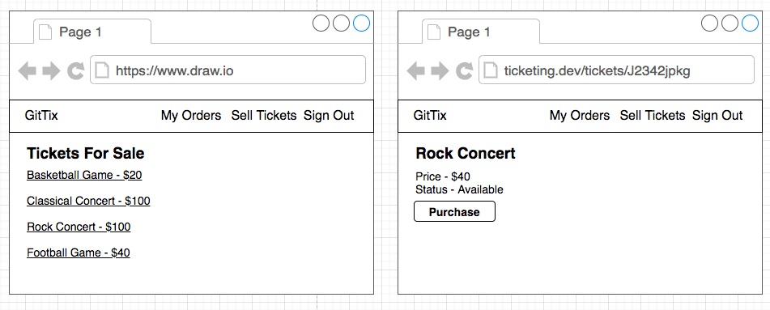
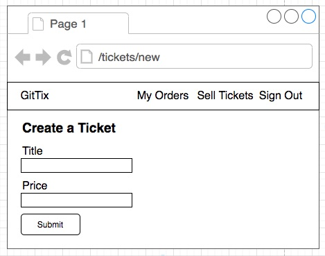
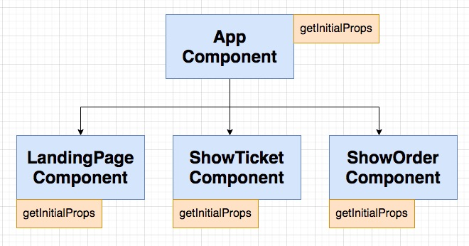
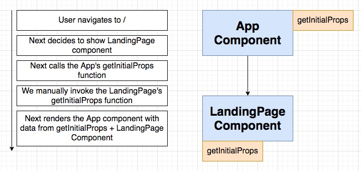

## **Section 22: Back to the Client**

## Table of Contents
- [**Section 22: Back to the Client**](#section-22-back-to-the-client)
- [Table of Contents](#table-of-contents)
  - [A Few More Pages](#a-few-more-pages)
  - [Reminder on Data Fetching with Next](#reminder-on-data-fetching-with-next)
  - [Two Quick Fixes](#two-quick-fixes)
  - [Scaffolding a Form](#scaffolding-a-form)
  - [Sanitizing Price Input](#sanitizing-price-input)
  - [Ticket Creation](#ticket-creation)
  - [Listing All Tickets](#listing-all-tickets)
  - [Linking to Wildcard Routes](#linking-to-wildcard-routes)
  - [Creating an Order](#creating-an-order)
  - [Programmatic Navigation to Wildcard Routes](#programmatic-navigation-to-wildcard-routes)
  - [The Expiration Timer](#the-expiration-timer)
  - [Displaying the Expiration](#displaying-the-expiration)
  - [Showing a Stripe Payment Form](#showing-a-stripe-payment-form)
  - [Configuring Stripe](#configuring-stripe)
  - [Test Credit Card Numbers](#test-credit-card-numbers)
  - [Paying for an Order](#paying-for-an-order)
  - [Filtering Reserved Tickets](#filtering-reserved-tickets)
  - [Header Links](#header-links)
  - [Rendering a List of Orders](#rendering-a-list-of-orders)

### A Few More Pages






**[⬆ back to top](#table-of-contents)**

### Reminder on Data Fetching with Next




**[⬆ back to top](#table-of-contents)**

### Two Quick Fixes

- Type 'thisisunsafe' in Chrome to bypass security warning
- Fetch getCurrentUser in _app.js and index.js

```javascript
const AppComponent = ({ Component, pageProps, currentUser }) => {
  // Fix #1: pass currentUser directly into Component
  return (
    <div>
      <Header currentUser={currentUser} />
      <Component currentUser={currentUser} {...pageProps}  />
    </div>
  );
};

AppComponent.getInitialProps = async appContext => {
  const client = buildClient(appContext.ctx);
  const { data } = await client.get('/api/users/currentuser');

  let pageProps = {};
  if(appContext.Component.getInitialProps) {
    // Fix #2
    pageProps = await appContext.Component.getInitialProps(appContext.ctx, client, data.currentUser);
  }

  return {
    pageProps,
    ...data
  };
};

export default AppComponent;
```


**[⬆ back to top](#table-of-contents)**

### Scaffolding a Form

```javascript
const NewTicket = () => {
  return (
    <div>
      <h1>Create a Ticket</h1>
      <form>
        <div className="form-group">
          <label>Title</label>
          <input className="form-control" />
        </div>
        <div className="form-group">
          <label>Price</label>
          <input className="form-control" />
        </div>
        <button className="btn btn-primary">Submit</button>
      </form>
    </div>
  );
};

export default NewTicket;
```

**[⬆ back to top](#table-of-contents)**

### Sanitizing Price Input

```javascript
import { useState } from 'react';

const NewTicket = () => {
  const [title, setTitle] = useState('');
  const [price, setPrice] = useState('');

  const onBlur = () => {
    const value = parseFloat(price);

    if (isNaN(value)) {
      return;
    }

    setPrice(value.toFixed(2));
  };

  return (
    <div>
      <h1>Create a Ticket</h1>
      <form>
        <div className="form-group">
          <label>Title</label>
          <input
            value={title}
            onChange={(e) => setTitle(e.target.value)}
            className="form-control"
          />
        </div>
        <div className="form-group">
          <label>Price</label>
          <input
            value={price}
            onBlur={onBlur}
            onChange={(e) => setPrice(e.target.value)}
            className="form-control"
          />
        </div>
        <button className="btn btn-primary">Submit</button>
      </form>
    </div>
  );
};

export default NewTicket;
```

**[⬆ back to top](#table-of-contents)**

### Ticket Creation

```javascript
  const { doRequest, errors } = useRequest({
    url: '/api/tickets',
    method: 'post',
    body: {
      title,
      price,
    },
    onSuccess: (ticket) => console.log(ticket),
  });

  const onSubmit = (event) => {
    event.preventDefault();

    doRequest();
  };
```

**[⬆ back to top](#table-of-contents)**

### Listing All Tickets

- route to landing page ('/') after create a new ticket
```javascript
onSuccess: () => Router.push('/')
```

```javascript
const LandingPage = ({ currentUser, tickets }) => {
  const ticketList = tickets.map((ticket) => {
    return (
      <tr key={ticket.id}>
        <td>{ticket.title}</td>
        <td>{ticket.price}</td>
      </tr>
    );
  });

  return (
    <div>
      <h1>Tickets</h1>
      <table className="table">
        <thead>
          <tr>
            <th>Title</th>
            <th>Price</th>
          </tr>
        </thead>
        <tbody>{ticketList}</tbody>
      </table>
    </div>
  );
};

LandingPage.getInitialProps = async (context, client, currentUser) => {
  const { data } = await client.get('/api/tickets');

  return { tickets: data };
};

export default LandingPage;
```

**[⬆ back to top](#table-of-contents)**

### Linking to Wildcard Routes

```javascript
  <Link href="/tickets/[ticketId]" as={`/tickets/${ticket.id}`}>
    <a>View</a>
  </Link>
```

**[⬆ back to top](#table-of-contents)**

### Creating an Order

```javascript
import useRequest from '../../hooks/use-request';

const TicketShow = ({ ticket }) => {
  const { doRequest, errors } = useRequest({
    url: '/api/orders',
    method: 'post',
    body: {
      ticketId: ticket.id,
    },
    onSuccess: (order) => console.log(order),
  });

  return (
    <div>
      <h1>{ticket.title}</h1>
      <h4>Price: {ticket.price}</h4>
      {errors}
      <button onClick={doRequest} className="btn btn-primary">
        Purchase
      </button>
    </div>
  );
};

TicketShow.getInitialProps = async (context, client) => {
  const { ticketId } = context.query;
  const { data } = await client.get(`/api/tickets/${ticketId}`);

  return { ticket: data };
};

export default TicketShow;
```

**[⬆ back to top](#table-of-contents)**

### Programmatic Navigation to Wildcard Routes

- Route to show new order after reserved ticket 
```javascript
onSuccess: (order) => Router.push('/orders/[orderId]', `/orders/${order.id}`),
```

**[⬆ back to top](#table-of-contents)**

### The Expiration Timer

```javascript
import { useEffect, useState } from 'react';

const OrderShow = ({ order }) => {
  const [timeLeft, setTimeLeft] = useState('');

  useEffect(() => {
    const findTimeLeft = () => {
      const msLeft = new Date(order.expiresAt) - new Date();
      setTimeLeft(Math.round(msLeft / 1000));
    };

    findTimeLeft();
    const timerId = setInterval(findTimeLeft, 1000);

    return () => {
      clearInterval(timerId);
    };
  }, [order]);

  return <div>Time left to pay: {timeLeft} seconds</div>;
};

OrderShow.getInitialProps = async (context, client) => {
  const { orderId } = context.query;
  const { data } = await client.get(`/api/orders/${orderId}`);

  return { order: data };
};

export default OrderShow;
```

**[⬆ back to top](#table-of-contents)**

### Displaying the Expiration

```javascript
  if (timeLeft < 0) {
    return <div>Order Expired</div>;
  }
```

**[⬆ back to top](#table-of-contents)**

### Showing a Stripe Payment Form

- [react-stripe-checkout](https://github.com/azmenak/react-stripe-checkout)

**[⬆ back to top](#table-of-contents)**

### Configuring Stripe

```javascript
  return (
    <div>
      Time left to pay: {timeLeft} seconds
      <StripeCheckout
        token={(token) => console.log(token)}
        stripeKey="pk_test_FlLFVapGHTly3FicMdTU06SC006tWtWbNH"
        amount={order.ticket.price * 100}
        email={currentUser.email}
      />
    </div>
  );
```

**[⬆ back to top](#table-of-contents)**

### Test Credit Card Numbers

- [Testing](https://stripe.com/docs/testing)

**[⬆ back to top](#table-of-contents)**

### Paying for an Order

```javascript
  const { doRequest, errors } = useRequest({
    url: '/api/payments',
    method: 'post',
    body: {
      orderId: order.id,
    },
    onSuccess: (payment) => console.log(payment),
  });
```

**[⬆ back to top](#table-of-contents)**

### Filtering Reserved Tickets

```typescript
  const tickets = await Ticket.find({
    orderId: undefined,
  });
```

**[⬆ back to top](#table-of-contents)**

### Header Links
**[⬆ back to top](#table-of-contents)**

### Rendering a List of Orders
**[⬆ back to top](#table-of-contents)**
