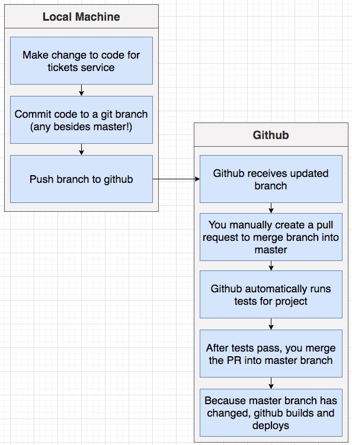
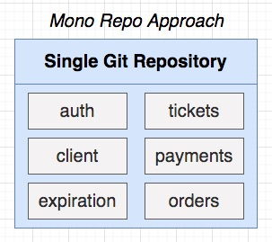
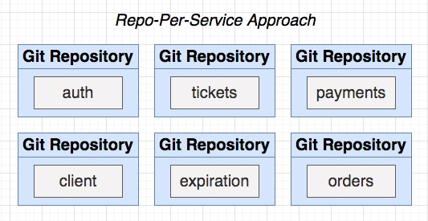
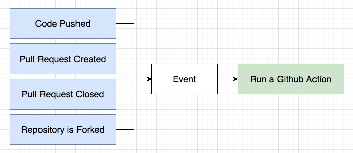
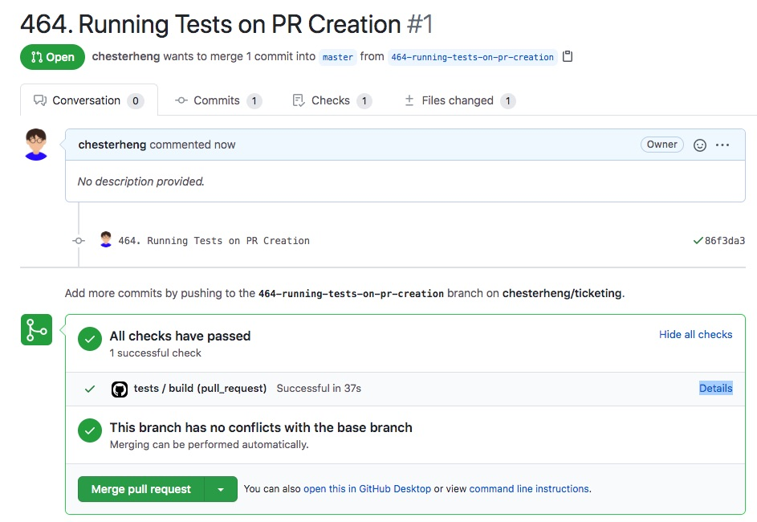
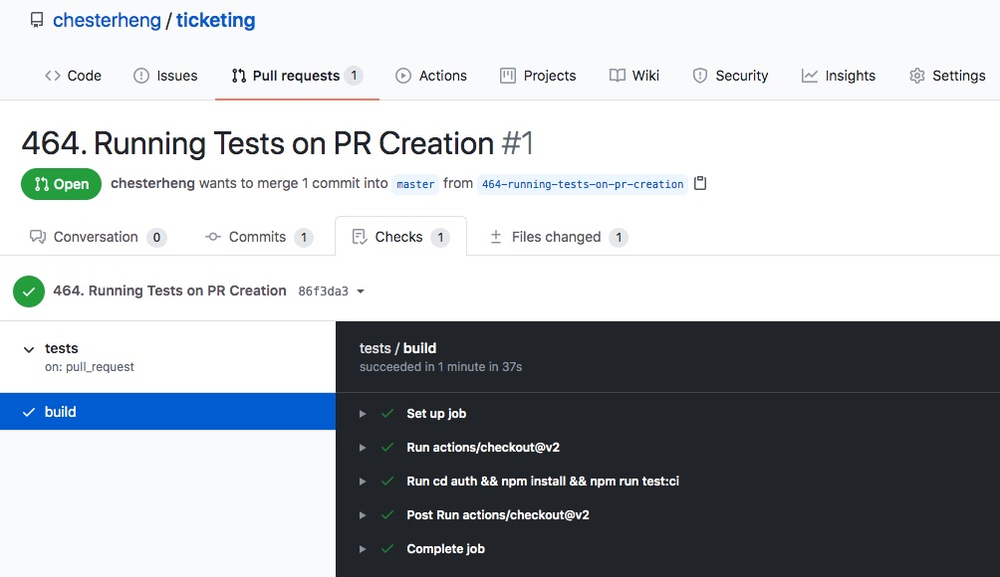
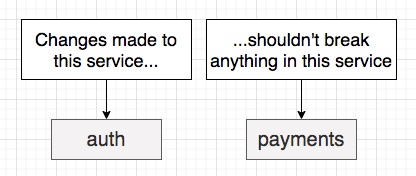

## **Section 23: CI/CD**

## Table of Contents
- [**Section 23: CI/CD**](#section-23-cicd)
- [Table of Contents](#table-of-contents)
  - [Development Workflow](#development-workflow)
  - [Git Repository Approaches](#git-repository-approaches)
  - [Creating a GitHub Action](#creating-a-github-action)
  - [Adding a CI Test Script](#adding-a-ci-test-script)
  - [Running Tests on PR Creation](#running-tests-on-pr-creation)
  - [Output of Failing Tests](#output-of-failing-tests)
  - [Running Tests in Parallel](#running-tests-in-parallel)
  - [Verifying a Test Run](#verifying-a-test-run)
  - [Selective Test Execution](#selective-test-execution)
  - [Deployment Options](#deployment-options)
  - [Creating a Hosted Cluster](#creating-a-hosted-cluster)
  - [Reminder on Kubernetes Context](#reminder-on-kubernetes-context)
  - [Reminder on Swapping Contexts](#reminder-on-swapping-contexts)
  - [The Deployment Plan](#the-deployment-plan)
  - [Building an Image in an Action](#building-an-image-in-an-action)
  - [Testing the Image Build](#testing-the-image-build)
  - [Restarting the Deployment](#restarting-the-deployment)
  - [Applying Kubernetes Manifests](#applying-kubernetes-manifests)
  - [Prod vs Dev Manifest Files](#prod-vs-dev-manifest-files)
  - [Manual Secret Creation](#manual-secret-creation)
  - [Don't Forget Ingress-Nginx!](#dont-forget-ingress-nginx)
  - [Testing Automated Deployment](#testing-automated-deployment)
  - [Additional Deploy Files](#additional-deploy-files)
  - [A Successful Deploy!](#a-successful-deploy)
  - [Buying a Domain Name](#buying-a-domain-name)
  - [Configuring the Domain Name](#configuring-the-domain-name)
  - [One Small Fix](#one-small-fix)
  - [One More Small Fix](#one-more-small-fix)
  - [I Really Hope This Works](#i-really-hope-this-works)
  - [Next Steps](#next-steps)

### Development Workflow




**[⬆ back to top](#table-of-contents)**

### Git Repository Approaches

- Mono Repo Approach (selected)
- Repo-Per-Service Approach (not selected, many overheads)




- copy ticketing folder to Desktop
- open ticketing folder with VS Code
```console
git init
```
- create .gitignore
```git
node_modules
.DS_Store
```
```console
git add .
git commit -m "initial commit"
```
- goto github
- create a new repo: ticketing
- goto ticketing folder
```console
git remote add origin https://github.com/chesterheng/ticketing.git
git push origin master
```
- Refer to https://github.com/chesterheng/ticketing

**[⬆ back to top](#table-of-contents)**

### Creating a GitHub Action



- [GitHub Actions Documentation](https://docs.github.com/en/actions)
- [Events that trigger workflows](https://docs.github.com/en/actions/reference/events-that-trigger-workflows)

```yml
name: tests

on: 
  pull_request:

jobs:
  build:
    runs-on: ubuntu-latest
    steps:
      - uses: actions/checkout@v2
      - run: cd auth && npm install && npm run test:ci
```

**[⬆ back to top](#table-of-contents)**

### Adding a CI Test Script

- to run test only one time

```json
  "test:ci": "jest"
```

```console
git status
git add .
git commit -m "463. Adding a CI Test Script"
git pull origin master
git push origin master
```

**[⬆ back to top](#table-of-contents)**

### Running Tests on PR Creation

Local Machine

- Make change to code for tickets service
- Commit code to a git branch (any besides master!)
```console
git branch -m 464-running-tests-on-pr-creation
git add .
git commit -m "464. Running Tests on PR Creation"
git push --set-upstream origin 464-running-tests-on-pr-creation
```
- Push branch to github



**[⬆ back to top](#table-of-contents)**

### Output of Failing Tests

- Change expect result to make test fails
```console
git add .
git commit -m "465. Output of Failing Tests"
git push
```

Github

- Github receives updated branch
- You manually create a pull request to merge branch into master
- Github automatically runs tests for project

**[⬆ back to top](#table-of-contents)**

### Running Tests in Parallel

```yaml
name: tests-orders

on: 
  pull_request:

jobs:
  build:
    runs-on: ubuntu-latest
    steps:
      - uses: actions/checkout@v2
      - run: cd orders && npm install && npm run test:ci
```

```yaml
name: tests-payments

on: 
  pull_request:

jobs:
  build:
    runs-on: ubuntu-latest
    steps:
      - uses: actions/checkout@v2
      - run: cd payments && npm install && npm run test:ci
```

```yaml
name: tests-tickets

on: 
  pull_request:

jobs:
  build:
    runs-on: ubuntu-latest
    steps:
      - uses: actions/checkout@v2
      - run: cd tickets && npm install && npm run test:ci
```

**[⬆ back to top](#table-of-contents)**

### Verifying a Test Run

- make a change and commit
- push a PR and see 4 tests run in parallel

**[⬆ back to top](#table-of-contents)**

### Selective Test Execution



- paths parameter
- run auth test if path change is auth folder

```yaml
name: tests-auth

on: 
  pull_request:
    paths:
      - 'auth/**'

jobs:
  build:
    runs-on: ubuntu-latest
    steps:
      - uses: actions/checkout@v2
      - run: cd auth && npm install && npm run test:ci
```

**[⬆ back to top](#table-of-contents)**

### Deployment Options

- A credit card will be required to move forward
- $1 for a domain name, $0.72 a day to run the cluster
- You can probably find a coupon code to pay $0 for the cluster

3 nodes, each with 2gb ram + 1 cpu PLUS EXTRAS

| Digital Ocean      | AWS        | Google Cloud | Azure     |
| ------------------ | ---------- | ------------ | --------- |
| $40/month          | $126/month | $113/month   | $72/month |
| Really easy to use | Hardest    | Easy         | Easy      |

- Digital Ocean is selected

**[⬆ back to top](#table-of-contents)**

### Creating a Hosted Cluster
**[⬆ back to top](#table-of-contents)**

### Reminder on Kubernetes Context
**[⬆ back to top](#table-of-contents)**

### Reminder on Swapping Contexts
**[⬆ back to top](#table-of-contents)**

### The Deployment Plan
**[⬆ back to top](#table-of-contents)**

### Building an Image in an Action
**[⬆ back to top](#table-of-contents)**

### Testing the Image Build
**[⬆ back to top](#table-of-contents)**

### Restarting the Deployment
**[⬆ back to top](#table-of-contents)**

### Applying Kubernetes Manifests
**[⬆ back to top](#table-of-contents)**

### Prod vs Dev Manifest Files
**[⬆ back to top](#table-of-contents)**

### Manual Secret Creation
**[⬆ back to top](#table-of-contents)**

### Don't Forget Ingress-Nginx!
**[⬆ back to top](#table-of-contents)**

### Testing Automated Deployment
**[⬆ back to top](#table-of-contents)**

### Additional Deploy Files
**[⬆ back to top](#table-of-contents)**

### A Successful Deploy!
**[⬆ back to top](#table-of-contents)**

### Buying a Domain Name
**[⬆ back to top](#table-of-contents)**

### Configuring the Domain Name
**[⬆ back to top](#table-of-contents)**

### One Small Fix
**[⬆ back to top](#table-of-contents)**

### One More Small Fix
**[⬆ back to top](#table-of-contents)**

### I Really Hope This Works
**[⬆ back to top](#table-of-contents)**

### Next Steps
**[⬆ back to top](#table-of-contents)**